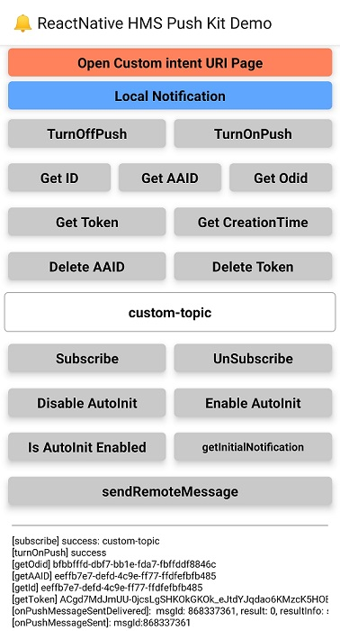
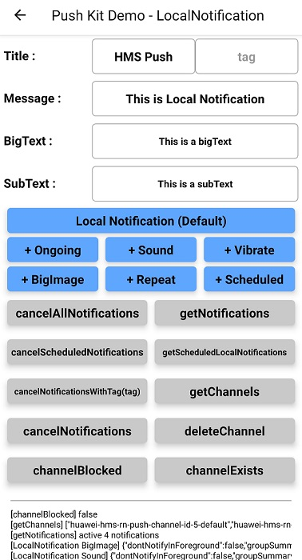

# React-Native HMS Push 

## Table of contents
* [Introduction](#introduction)
* [Installation Guide](#installation-guide)
* [API Definition](#api-definition)
* [Sample Project](#sample-project)
* [Question or Issues](#question-or-issues)
* [License and Terms](#license-and-terms)

## Introduction
This module enables communication between **Huawei Push SDK** and React Native platform. It exposes all functionality provided by Huawei Push SDK.

## Installation Guide
Before using **@hmscore/react-native-hms-push**, ensure that the RN development environment has been installed.

### 1. Install @hmscore/react-native-hms-push
#### Install via NPM,
```
npm i @hmscore/react-native-hms-push
```
#### Or, copy the library into the demo project 
In order to reach the library from demo app, the library should be copied under the node_modules folder of the project.
 
The structure should be like this

            demo-app
                |_ node_modules
                    |_ @hmscore
                        |_ react-native-hms-push
                        ...
### 2.2. Add Push package to your application
```java
import com.huawei.hms.rn.push.HmsPushPackage; // <-- Add this import line with HmsPushPackage name.
```
Then add the following line to your getPackages() method.
```java
 packages.add(new HmsPushPackage()); // <-- Add this line
```
### 2.3. Copy the **agconnect-service.json** file to the **android/app** directory of the demo project.

- Create an app by referring to [Creating an AppGallery Connect Project](https://developer.huawei.com/consumer/en/doc/development/AppGallery-connect-Guides/agc-get-started#h1-1587521853252) and [Adding an App to the Project](https://developer.huawei.com/consumer/en/doc/development/AppGallery-connect-Guides/agc-get-started#h1-1587521946133).

- A signing certificate fingerprint is used to verify the authenticity of an app when it attempts to access an HMS Core (APK) through the HMS SDK. Before using the HMS Core (APK), you must locally generate a signing certificate fingerprint and configure it in AppGallery Connect.  For details, please refer to [Generating a Signing Certificate](https://developer.huawei.com/consumer/en/codelab/HMSPreparation/index.html#3).

- Sign in to [AppGallery Connect](https://developer.huawei.com/consumer/en/service/josp/agc/index.html) and select **My apps**. Then, on the **Project Setting** page, set **SHA-256 certificate fingerprint** to the SHA-256 fingerprint from [Configuring the Signing Certificate Fingerprint](https://developer.huawei.com/consumer/en/doc/development/HMS-Guides/iap-configuring-appGallery-connect).

- In [AppGallery Connect](https://developer.huawei.com/consumer/en/service/josp/agc/index.html), on **My projects** page, in **Manage APIs** tab, find and activate **Push API**, then on **My projects** page, find **Promotion -> Push Kit** and set required settings. For more information, please refer to [Setting HUAWEI Push Kit Parameters](https://developer.huawei.com/consumer/en/doc/distribution/app/agc-enable_service#h1-1574823053380).

- In [AppGallery Connect](https://developer.huawei.com/consumer/en/service/josp/agc/index.html), on **My apps** page, find your app from the list and click the app name. Go to **Development > Overview > App Information**. Click **agconnect-service.json** to download configuration file. 

- Finally, copy the **agconnect-service.json** file to the **android/app** directory of the demo project.

- **Package name must match with the _package_name_ entry in _agconnect-services.json_ file.**

```gradle
defaultConfig {
    applicationId "<package_name>"
    minSdkVersion 19 //minSdkVersion to 19 or higher.
    /*
     * <Other configurations>
     */
}
```

- **Do not forget to copy the signature file that generated in [Generating a Signing Certificate](https://developer.huawei.com/consumer/en/codelab/HMSPreparation/index.html#3) to _android/app_ directory.**

     Configure the signature in **android** according to the signature file information.

```gradle
android {
    /*
     * <Other configurations>
     */

    signingConfigs {
        config {
            storeFile file('<keystore_file>.jks')
            storePassword '<keystore_password>'
            keyAlias '<key_alias>'
            keyPassword '<key_password>'
        }
    }

    buildTypes {
        debug {
            signingConfig signingConfigs.config
        }
        release {
            signingConfig signingConfigs.config
        }
    }
}
```

## API Definition

### **HmsPushInstanceId**

#### Public Method Summary

| Method                                | Return Type  | Description                          |
|---------------------------------------|--------------|--------------------------------------|
| getToken(Callback callback)           | void         | Obtains a token required for accessing HUAWEI Push Kit. |
| getId(Callback callback)              | void         | Obtains an AAID in synchronous mode. |
| getAAID(Callback callback)            | void         | Obtains an AAID in asynchronous mode. |
| getCreationTime(Callback callback)    | void         | Obtains the generation timestamp of an AAID. |
| deleteAAID(Callback callback)         | void         | Deletes a local AAID and its generation timestamp. |
| deleteToken(Callback callback)        | void         | Deletes a token. |

#### Public Methods

##### HmsPushInstanceId.getId((resultCode, resultInfo) => {})
This method is used to obtain an AAID in synchronous mode. Before applying for a token, an app calls this method to obtain its unique AAID. The HUAWEI Push server generates a token for the app based on the AAID. If the AAID of the app changes, a new token will be generated next time when the app applies for a token. If an app needs to report statistics events, it must carry the AAID as its unique ID.

###### Parameters

| Name       |  Description                          |
|------------|---------------------------------------|
| resultCode | 0 means success, and a non-zero value means failure. |
| resultInfo | If resultCode is set to a value other than 0, the operation fails and resultInfo indicates the error information. Otherwise, the operation is successful and the value of resultInfo needs to be understood based on the function of the method actually used. |

###### Call Example

```javascript
    HmsPushInstanceId.getId((result, resultInfo) => {
      this.log(
        result == HmsPushResultCode.SUCCESS
          ? '[getId] ' + resultInfo
          : '[getId] Error/Exception: ' + result,
      );
    });
```

##### HmsPushInstanceId.getAAID((resultCode, resultInfo) => {})
This method is used to obtain an AAID in asynchronous mode.

###### Parameters

| Name       |  Description                          |
|------------|---------------------------------------|
| resultCode | 0 means success, and a non-zero value means failure. |
| resultInfo | If resultCode is set to a value other than 0, the operation fails and resultInfo indicates the error information. Otherwise, the operation is successful and the value of resultInfo needs to be understood based on the function of the method actually used. |

###### Call Example

```javascript
    HmsPushInstanceId.getAAID((result, resultInfo) => {
      this.log(result == HmsPushResultCode.SUCCESS
        ? '[getAAID] ' + resultInfo
        : '[getAAID] Error/Exception: ' + result);
    });
```

##### HmsPushInstanceId.getCreationTime((resultCode, resultInfo) => {})
This method is used to obtain the generation timestamp of an AAID.

###### Parameters

| Name       |  Description                          |
|------------|---------------------------------------|
| resultCode | 0 means success, and a non-zero value means failure. |
| resultInfo | If resultCode is set to a value other than 0, the operation fails and resultInfo indicates the error information. Otherwise, the operation is successful and the value of resultInfo needs to be understood based on the function of the method actually used. |

###### Call Example

```javascript
    HmsPushInstanceId.getCreationTime((result, resultInfo) => {
      this.log(
        result == HmsPushResultCode.SUCCESS
          ? '[getCreationTime] ' + resultInfo
          : '[getCreationTime] Error/Exception: ' + result,
      );
    });
```

##### HmsPushInstanceId.deleteAAID((resultCode, resultInfo) => {})
This method is used to delete a local AAID and its generation timestamp.

###### Parameters

| Name       |  Description                          |
|------------|---------------------------------------|
| resultCode | 0 means success, and a non-zero value means failure. |
| resultInfo | If resultCode is set to a value other than 0, the operation fails and resultInfo indicates the error information. Otherwise, the operation is successful and the value of resultInfo needs to be understood based on the function of the method actually used. |

###### Call Example

```javascript
    HmsPushInstanceId.deleteAAID((result, resultInfo) => {
      this.log(
        result == HmsPushResultCode.SUCCESS
          ? '[deleteAAID] success'
          : '[deleteAAID] Error/Exception: ' + resultInfo,
      );
    });
```

##### HmsPushInstanceId.getToken((resultCode, resultInfo) => {})
This method is used to obtain a token required for accessing HUAWEI Push Kit. If there is no local AAID, this method will automatically generate an AAID when it is called because the HUAWEI Push Kit server needs to generate a token based on the AAID.

###### Parameters

| Name       |  Description                          |
|------------|---------------------------------------|
| resultCode | 0 means success, and a non-zero value means failure. |
| resultInfo | If resultCode is set to a value other than 0, the operation fails and resultInfo indicates the error information. Otherwise, the operation is successful and the value of resultInfo needs to be understood based on the function of the method actually used. |

###### Call Example

```javascript
    HmsPushInstanceId.getToken((result, resultInfo) => {
      this.log(
        result == HmsPushResultCode.SUCCESS
          ? '[getToken] ' + resultInfo
          : '[getToken] Error/Exception: ' + result,
      );
    });
```

##### HmsPushInstanceId.deleteToken((resultCode, resultInfo) => {})
This method is used to delete a token. After a token is deleted, the corresponding AAID will not be deleted. This method is a synchronous method.

###### Parameters

| Name       |  Description                          |
|------------|---------------------------------------|
| resultCode | 0 means success, and a non-zero value means failure. |
| resultInfo | If resultCode is set to a value other than 0, the operation fails and resultInfo indicates the error information. Otherwise, the operation is successful and the value of resultInfo needs to be understood based on the function of the method actually used. |

###### Call Example

```javascript
    HmsPushInstanceId.deleteToken((result, resultInfo) => {
      this.log(
        result == HmsPushResultCode.SUCCESS
          ? '[deleteToken] success'
          : '[deleteToken] Error/Exception: ' + result,
      );
    });
```


### **HmsPushMessaging**

#### Public Method Summary

| Method                                | Return Type  | Description                          |
|---------------------------------------|--------------|--------------------------------------|
| isAutoInitEnabled(Callback callback)           | void         | Checks whether automatic initialization is enabled. |
| setAutoInitEnabled(boolean enabled,Callback callback)              | void         | Determines whether to enable automatic initialization. |
| turnOnPush(Callback callback)            | void         | Enables the function of receiving notification messages in asynchronous mode. |
| turnOffPush(Callback callback)    | void         | Disables the function of receiving notification messages in asynchronous mode. |
| subscribe(String topic, Callback callBack)         | void         | Subscribes to topics in asynchronous mode. |
| unsubscribe(String topic, Callback callBack)         | void         | Unsubscribes from topics in asynchronous mode. |
| sendRemoteMessage(ReadableMap uplinkMessage)         | void         | Sends an uplink message to the app server. |
| getInitialNotification(Callback callback)         | void         | Returns the **remoteMessage** of the notification which opened the app, when the app was in quit state. |
| enableLogger()         | void         | Enables HMS Plugin Method Analytics. |
| disableLogger()         | void         | Disables HMS Plugin Method Analytics. |

#### Public Methods

##### HmsPushMessaging.isAutoInitEnabled((resultCode, resultInfo) => {})
Checks whether automatic initialization is enabled.

###### Parameters

| Name       |  Description                          |
|------------|---------------------------------------|
| resultCode | 0 means success, and a non-zero value means failure. |
| resultInfo | If resultCode is set to a value other than 0, the operation fails and resultInfo indicates the error information. Otherwise, the operation is successful and the value of resultInfo needs to be understood based on the function of the method actually used. |

###### Call Example

```javascript
    HmsPushMessaging.isAutoInitEnabled((result, resultInfo) => {
      this.log(
        result == HmsPushResultCode.SUCCESS
          ? '[isAutoInitEnabled] success ' + resultInfo
          : '[isAutoInitEnabled] Error/Exception: ' + resultInfo,
      );
    });
```

##### HmsPushMessaging.setAutoInitEnabled(boolean enabled, (resultCode, resultInfo) => {})
This method is used to determine whether to enable automatic initialization. If this parameter is set to **true**, the SDK automatically generates an AAID and applies for a token.

###### Parameters

| Name       |  Description                          |
|------------|---------------------------------------|
| enabled    | Indicates whether to enable automatic initialization. The value true indicates yes and false indicates no. |
| resultCode | 0 means success, and a non-zero value means failure. |
| resultInfo | If resultCode is set to a value other than 0, the operation fails and resultInfo indicates the error information. Otherwise, the operation is successful and the value of resultInfo needs to be understood based on the function of the method actually used. |

###### Call Example

```javascript
    HmsPushMessaging.setAutoInitEnabled(true, (result, resultInfo) => {
      this.log(
        result == HmsPushResultCode.SUCCESS
          ? '[setAutoInitEnabled] ' + value + ' success ' + resultInfo
          : '[setAutoInitEnabled] Error/Exception: ' + value + resultInfo,
      );
    });
```

##### HmsPushMessaging.subscribe(String topic, (resultCode, resultInfo) => {})
This method is used to subscribe to topics in asynchronous mode. The HUAWEI Push Kit topic messaging function allows you to send messages to multiple devices whose users have subscribed to a specific topic. You can write messages about the topic as required, and HUAWEI Push Kit determines the release path and sends messages to the correct devices in a reliable manner.

###### Parameters

| Name       |  Description                          |
|------------|---------------------------------------|
| topic      | Topic to be subscribed to. The value must match the following regular expression: [\u4e00-\u9fa5\w-_.~%]{1,900}. |
| resultCode | 0 means success, and a non-zero value means failure. |
| resultInfo | If resultCode is set to a value other than 0, the operation fails and resultInfo indicates the error information. Otherwise, the operation is successful and the value of resultInfo needs to be understood based on the function of the method actually used. |

###### Call Example

```javascript
    HmsPushMessaging.subscribe("hmscore-13", (result, resultInfo) => {
      this.log(
        result == HmsPushResultCode.SUCCESS
          ? '[subscribe] success: ' + "hmscore-13"
          : '[subscribe] Error/Exception: ' + resultInfo,
      );
    });
```

##### HmsPushMessaging.unsubscribe(String topic, (resultCode, resultInfo) => {})
This method is used to unsubscribe from topics that are subscribed to through the subscribe method.

###### Parameters

| Name       |  Description                          |
|------------|---------------------------------------|
| topic      | Topic to be subscribed to. The value must match the following regular expression: [\u4e00-\u9fa5\w-_.~%]{1,900}. |
| resultCode | 0 means success, and a non-zero value means failure. |
| resultInfo | If resultCode is set to a value other than 0, the operation fails and resultInfo indicates the error information. Otherwise, the operation is successful and the value of resultInfo needs to be understood based on the function of the method actually used. |

###### Call Example

```javascript
    HmsPushMessaging.unsubscribe("hmscore-13", (result, resultInfo) => {
      this.log(
        result == HmsPushResultCode.SUCCESS
          ? '[unsubscribe] success : ' + "hmscore-13"
          : '[unsubscribe] Error/Exception: ' + resultInfo,
      );
    });
```

##### HmsPushMessaging.turnOnPush((resultCode, resultInfo) => {})
This method is used to enable the display of notification messages. If you want to control the display of notification messages in an app, you can call this method. This method applies to notification messages but not data messages. It is the app that determines whether to enable data messaging.

###### Parameters

| Name       |  Description                          |
|------------|---------------------------------------|
| resultCode | 0 means success, and a non-zero value means failure. |
| resultInfo | If resultCode is set to a value other than 0, the operation fails and resultInfo indicates the error information. Otherwise, the operation is successful and the value of resultInfo needs to be understood based on the function of the method actually used. |

###### Call Example

```javascript
    HmsPushMessaging.turnOnPush((result, resultInfo) => {
      this.log(
        result == HmsPushResultCode.SUCCESS
          ? '[turnOnPush] success'
          : '[turnOnPush] Error/Exception: ' + result,
      );
    });
```

##### HmsPushMessaging.turnOffPush((resultCode, resultInfo) => {})
This method is used to disable the display of notification messages. If you want to control the display of notification messages in an app, you can call this method. This method applies to notification messages but not data messages. It is the app that determines whether to enable data messaging.

###### Parameters

| Name       |  Description                          |
|------------|---------------------------------------|
| resultCode | 0 means success, and a non-zero value means failure. |
| resultInfo | If resultCode is set to a value other than 0, the operation fails and resultInfo indicates the error information. Otherwise, the operation is successful and the value of resultInfo needs to be understood based on the function of the method actually used. |

###### Call Example

```javascript
    HmsPushMessaging.turnOffPush((result, resultInfo) => {
      this.log(
        result == HmsPushResultCode.SUCCESS
          ? '[turnOffPush] success'
          : '[turnOffPush] Error/Exception: ' + result,
      );
    });
```

##### HmsPushMessaging.sendRemoteMessage(uplinkMessage)
Sends an uplink message to the application server.

###### Parameters

| Name       |  Description                          |
|------------|---------------------------------------|
| uplinkMessage | Remote message to be sent to the application server |

###### Call Example

```javascript
    HmsPushMessaging.sendRemoteMessage(
      {
        [RemoteMessageBuilder.TO]: '',
        //[RemoteMessageBuilder.MESSAGE_ID]: '', // Auto generated
        [RemoteMessageBuilder.MESSAGE_TYPE]: 'hms',
        [RemoteMessageBuilder.COLLAPSE_KEY]: '-1',
        [RemoteMessageBuilder.TTL]: 120,
        [RemoteMessageBuilder.RECEIPT_MODE]: 1,
        [RemoteMessageBuilder.SEND_MODE]: 1,
        [RemoteMessageBuilder.DATA]: { key1: 'test', message: 'huawei-test' },
      }
    );
```


##### HmsPushMessaging.getInitialNotification((resultCode, initialNotification) => {})
Returns the remoteMessage of the notification which opened the app from quit state. If the app is not opened by a notification, it returns null.

###### Parameters

| Name       |  Description                          |
|------------|---------------------------------------|
| resultCode | 0 means success, and a non-zero value means failure. |
| initialNotification | The remoteMessage of the notification which opened the app by a click. |

###### Call Example

```javascript
    HmsPushMessaging.getInitialNotification((result, initialNotification) => {
      this.log('[getInitialNotification] : ' + JSON.stringify(initialNotification));
    });
```

##### HmsPushMessaging.enableLogger()
This method enables HMSLogger capability which is used for sending usage analytics of Push SDK's methods to improve the service quality.

###### Parameters

None.

###### Call Example

```javascript
    HmsPushMessaging.enableLogger();
```

##### HmsPushMessaging.disableLogger()
This method disables HMSLogger capability which is used for sending usage analytics of Push SDK's methods to improve the service quality.

###### Parameters

None.

###### Call Example

```javascript
    HmsPushMessaging.disableLogger();
```

### **HmsPushOpenDevice**

#### Public Method Summary

| Method                                | Return Type  | Description                          |
|---------------------------------------|--------------|--------------------------------------|
| getOdid(Callback callback)            | void         | Obtains an Odid in asynchronous mode. |

#### Public Methods

##### HmsPushOpenDevice.getOdid((resultCode, resultInfo) => {})
This method is used to obtain an Odid in asynchronous mode.

###### Parameters

| Name       |  Description                          |
|------------|---------------------------------------|
| resultCode | 0 means success, and a non-zero value means failure. |
| resultInfo | If resultCode is set to a value other than 0, the operation fails and resultInfo indicates the error information. Otherwise, the operation is successful and the value of resultInfo needs to be understood based on the function of the method actually used. |

###### Call Example

```javascript
    HmsPushOpenDevice.getOdid((result, resultInfo) => {
      this.log(
        result == HmsPushResultCode.SUCCESS
          ? '[getOdid] ' + resultInfo
          : '[getOdid] Error/Exception: ' + resultsg,
      );
    });
```

### **HmsLocalNotification**

#### Public Method Summary

| Method                                                    | Return Type  | Description                          |
|-----------------------------------------------------------|--------------|--------------------------------------|
| localNotification(ReadableMap notification, Callback callback) | void         | Pushes a local notification instantly. |
| localNotificationSchedule(ReadableMap notification, Callback callback) | void         | Schedules a local notification to be pushed at a further time. |
| cancelAllNotifications(Callback callback) | void         | Cancels all pending scheduled notifications and the ones registered in the notification manager. |
| cancelNotifications(Callback callback) | void         | Cancels all pending notifications registered in the notification manager. |
| cancelScheduledNotifications(Callback callback) | void         | Cancels all pending scheduled notifications. |
| cancelNotificationsWithId(ReadableArray idArr, Callback callback) | void         | Cancels all pending notifications by an array of IDs. |
| cancelNotificationsWithIdTag(ReadableArray idTagArr, Callback callback) | void         | Cancels all pending notifications by an array of objects encapsulating the fields "**Id**" and "**tag**", both of the field values are strings. |
| cancelNotificationsWithTag(String tag, Callback callback) | void         | Cancel a notifcation with tag. |
| getNotifications(Callback callback) | void         | Returns an array of all notifications. |
| getScheduledNotifications(Callback callback) | void         | Returns a list of all pending scheduled notifications. |
| getChannels(Callback callback) | void         | Returns a string array of all notification channels. |
| channelExists(String channelId, Callback callback) | void         | Checks whether a notification channel with the given channelId exists. |
| channelBlocked(String channelId, Callback callback) | void         | Returns true if the notification channel with the specified ID is blocked |
| deleteChannel(String channelId, Callback callback) | void         | Deletes the notification channel with specified ID. |


#### Public Methods

##### HmsLocalNotification.localNotification(notification, (resultCode, resultInfo) => {})
Pushes a local notification instantly.

###### Parameters

| Name       |  Description                          |
|------------|---------------------------------------|
| notification | Local notification object to be pushed, refer **HmsLocalNotification.Attr** |
| resultCode | 0 means success, and a non-zero value means failure. |
| resultInfo | If resultCode is set to a value other than 0, the operation fails and resultInfo indicates the error information. Otherwise, the operation is successful and the value of resultInfo needs to be understood based on the function of the method actually used. |

###### Call Example

```javascript
    HmsLocalNotification.localNotification(
      {
        [HmsLocalNotification.Attr.title]: 'Notification Title',
        [HmsLocalNotification.Attr.message]: 'Notification Message', // (required)
        [HmsLocalNotification.Attr.title]: "HMS Push",
        [HmsLocalNotification.Attr.message]: "This is Local Notification",
        [HmsLocalNotification.Attr.bigText]: "This is a bigText",
        [HmsLocalNotification.Attr.subText]: "This is a bigText",
        [HmsLocalNotification.Attr.tag]: "push-tag",
        [HmsLocalNotification.Attr.largeIcon]: 'ic_launcher',
        [HmsLocalNotification.Attr.smallIcon]: 'ic_notification',
        [HmsLocalNotification.Attr.bigText]: 'This is a bigText',
        [HmsLocalNotification.Attr.subText]: 'This is a subText',
        [HmsLocalNotification.Attr.importance]: HmsLocalNotification.Importance.max,
      },
      (result, resultInfo) => {
        this.log(
          result == HmsPushResultCode.SUCCESS
            ? '[LocalNotification Default] ' + JSON.stringify(resultInfo)
            : '[LocalNotification Default] Error/Exception: ' + result,
          ToastAndroid.SHORT,
        );
      },
    );
```

##### HmsLocalNotification.localNotificationSchedule(notification, (resultCode, resultInfo) => {})
Schedules a local notification to be pushed at a further time.

###### Parameters

| Name       |  Description                          |
|------------|---------------------------------------|
| notification | Local notification object to be pushed, refer **HmsLocalNotification.Attr** |
| resultCode | 0 means success, and a non-zero value means failure. |
| resultInfo | If resultCode is set to a value other than 0, the operation fails and resultInfo indicates the error information. Otherwise, the operation is successful and the value of resultInfo needs to be understood based on the function of the method actually used. |

###### Call Example

```javascript
    HmsLocalNotification.localNotificationSchedule(
      {
        [HmsLocalNotification.Attr.title]: 'Notification Title',
        [HmsLocalNotification.Attr.message]: 'Notification Message', // (required)
        [HmsLocalNotification.Attr.fireDate]: new Date( Date.now() + 60 * 1000).getTime(), // in 1 min
        [HmsLocalNotification.Attr.title]: "HMS Push",
        [HmsLocalNotification.Attr.message]: "This is Local Notification",
        [HmsLocalNotification.Attr.bigText]: "This is a bigText",
        [HmsLocalNotification.Attr.subText]: "This is a bigText",
        [HmsLocalNotification.Attr.tag]: "push-tag",
        [HmsLocalNotification.Attr.largeIcon]: 'ic_launcher',
        [HmsLocalNotification.Attr.smallIcon]: 'ic_notification',
        [HmsLocalNotification.Attr.bigText]: 'This is a bigText',
        [HmsLocalNotification.Attr.subText]: 'This is a subText',
        [HmsLocalNotification.Attr.importance]: HmsLocalNotification.Importance.max,
      },
      (result, resultInfo) => {
        this.log(
          result == HmsPushResultCode.SUCCESS
            ? '[LocalNotification Default] ' + JSON.stringify(resultInfo)
            : '[LocalNotification Default] Error/Exception: ' + result,
          ToastAndroid.SHORT,
        );
      },
    );
```

##### HmsLocalNotification.cancelAllNotifications(callback)
Cancels all pending scheduled notifications and the ones registered in the notification manager.

###### Call Example

```javascript
    HmsLocalNotification.cancelAllNotifications()
```

##### HmsLocalNotification.cancelNotifications(callback)
Cancels all pending notifications registered in the notification manager.

###### Call Example

```javascript
  HmsLocalNotification.cancelNotifications();
```

##### HmsLocalNotification.cancelScheduledNotifications(callback)
Cancels all pending scheduled notifications.

###### Call Example

```javascript
   HmsLocalNotification.cancelScheduledNotifications();
```

##### HmsLocalNotification.cancelNotificationsWithId(idArr, callback)
Cancels all pending notifications by an array of IDs.

###### Call Example

```javascript
   HmsLocalNotification.cancelNotificationsWithId(["13","14"]);
```

##### HmsLocalNotification.cancelNotificationsWithIdTag(idTagArr, callback)
Cancels all pending notifications by an array of objects encapsulating the fields "**Id**" and "**tag**", both of the field values are strings.

###### Call Example

```javascript
   HmsLocalNotification.cancelNotificationsWithIdTag([{id:"13",tag:"some-tag"},{id:"14",tag:"some-tag"}]);
```

##### HmsLocalNotification.cancelNotificationsWithTag(tag, callback)
Cancel a notifications with tag.

###### Call Example

```javascript
   HmsLocalNotification.cancelNotificationsWithTag('tag');
```

##### HmsLocalNotification.getNotifications((resultCode, resultInfo) => {})
Returns an array of all notifications.

###### Call Example

```javascript
              HmsLocalNotification.getNotifications((result, resultInfo) => {
                this.log(
                  result == HmsPushResultCode.SUCCESS
                    ? '[getNotifications] active ' +
                    resultInfo.length +
                    ' notifications'
                    : '[getNotifications] Error/Exception: ' + result,
                );
              });
```

##### HmsLocalNotification.getScheduledNotifications((resultCode, resultInfo) => {})
Returns a list of all pending scheduled notifications.

###### Call Example

```javascript
              HmsLocalNotification.getScheduledNotifications(
                (result, resultInfo) => {
                  this.log(
                    result == HmsPushResultCode.SUCCESS
                      ? '[getScheduledNotifications] ' +
                      JSON.stringify(resultInfo) +
                      ' notifications'
                      : '[getNotifications] Error/Exception: ' + result,
                  );
                })
```

##### HmsLocalNotification.getChannels((resultCode, resultInfo) => {})
Returns a string array of all notification channels.

###### Call Example

```javascript
              HmsLocalNotification.getChannels((result, resultInfo) => {
                this.log(
                  result == HmsPushResultCode.SUCCESS
                    ? '[getChannels] ' +
                    JSON.stringify(resultInfo)
                    : '[getChannels] Error/Exception: ' + result,
                );
              });
```

##### HmsLocalNotification.channelExists(channeld, (resultCode, resultInfo) => {})
Returns true if the notification channel with the specified ID is exists.

###### Call Example

```javascript
              HmsLocalNotification.channelExists(
                'huawei-hms-rn-push-channel-id',
                (result, resultInfo) => {
                  this.log(
                    result == HmsPushResultCode.SUCCESS
                      ? '[channelExists] ' + resultInfo
                      : '[channelExists] Error/Exception: ' + result,
                  );
                },
              );
```

##### HmsLocalNotification.channelBlocked(channeld, (resultCode, resultInfo) => {})
Returns true if the notification channel with the specified ID is blocked.

###### Call Example

```javascript
              HmsLocalNotification.channelBlocked(
                'huawei-hms-rn-push-channel-id',
                (result, resultInfo) => {
                  this.log(
                    result == HmsPushResultCode.SUCCESS
                      ? '[channelBlocked] ' + resultInfo
                      : '[channelBlocked] Error/Exception: ' + result,
                  );
                },
              );
```

##### HmsLocalNotification.deleteChannel(channeld, (resultCode, resultInfo) => {})
Deletes the notification channel with specified ID.

###### Call Example

```javascript
    HmsLocalNotification.deleteChannel("hms-push-channel-custom");
```

#### HmsLocalNotification.Attr

This object contains the field names for local notifications attributes. These fields are used to construct local notification messages.

| Name                            | Type        | Description                          |
|---------------------------------|-------------|--------------------------------------|
| HmsLocalNotification.Attr.id    |  String  | An identifier for the notification message to be pushed. |
| HmsLocalNotification.Attr.message    |  String  | The message (second row) of the notification |
| HmsLocalNotification.Attr.fireDate    |  Date  | The time at which the notification will be posted. |
| HmsLocalNotification.Attr.title    |  String  | The title (first row) of the notification |
| HmsLocalNotification.Attr.ticker    |  ticker  | The ticker of the notification which is sent to the accessibility services |
| HmsLocalNotification.Attr.autoCancel    |  Boolean  | If true, the notification is dismissed on click. |
| HmsLocalNotification.Attr.largeIcon    |  String  | The name of the file to be set as the large icon for notification |
| HmsLocalNotification.Attr.largeIconUrl    |  String  | URL of the image to be set as the large icon for the notification to be pushed. |
| HmsLocalNotification.Attr.smallIcon    |  String  | The name of the file to be set as the small icon for notification |
| HmsLocalNotification.Attr.bigText    |  String  | The longer text to be displayed in the big form of the template |
| HmsLocalNotification.Attr.subText    |  String  | Additional information to be displayed in notification |
| HmsLocalNotification.Attr.bigPictureUrl    |  String  | URL of the image to be set as the big picture for the notification to be pushed. |
| HmsLocalNotification.Attr.shortcutId    |  String  | If the notification is duplicative of a launcher shortcut, sets the case the Launcher wants to hide the shortcut. |
| HmsLocalNotification.Attr.number    |  Number  | Sets the number of items this notification represents. Launchers that support badging may display it as a badge. |
| HmsLocalNotification.Attr.channelId    |  String  | The id of the notification channel for the notification to be pushed |
| HmsLocalNotification.Attr.channelName    |  String  | Name of the channel to be created for the notification to be pushed |
| HmsLocalNotification.Attr.channelDescription    |  String  | Description for the channel to be created for the notification to be pushed. |
| HmsLocalNotification.Attr.color    |  String  | The notification color in #RRGGBB or #AARRGGBB formats or string like 'white' |
| HmsLocalNotification.Attr.group    |  String  | The notification group, the notifications in the same group are displayed in a stacked way, if the device used supports such rendering. |
| HmsLocalNotification.Attr.groupSummary    |  Boolean  | If true, this notification is included in the specified group. |
| HmsLocalNotification.Attr.playSound    |  Boolean  | If true, the specified sound will be played when a notifcation message is pushed. |
| HmsLocalNotification.Attr.soundName    |  String  | Name of the sound file in the raw folder to be played, when a notification message is pushed. |
| HmsLocalNotification.Attr.vibrate    |  Boolean  | Turn on or off the vibration when a notification message a notification message is pushed. |
| HmsLocalNotification.Attr.vibrateDuration    |  Number  | The duration of the vibration when a notification message is pushed |
| HmsLocalNotification.Attr.actions    |  Array  | Adds action(s) to the notification to be pushed, actions are displayed as buttons adjacent notification content. |
| HmsLocalNotification.Attr.invokeApp    |  Boolean  | If true, the app pushed the notification is invoked when a pushed notification is clicked. |
| HmsLocalNotification.Attr.tag    |  String  | A tag for the notification to be set for identification |
| HmsLocalNotification.Attr.repeatType    |  HmsLocalNotification.RepeatType  | The time to repeat pushing for a scheduled notification. |
| HmsLocalNotification.Attr.repeatTime    |  Number  | The Time in milliseconds to repeat pushing the next scheduled notification message. |
| HmsLocalNotification.Attr.ongoing    |  Boolean  | If true, the notification to be pushed will be an ongoing notification, which can't be cancelled by the user by a swipe and the app must handle the cancelling. |
| HmsLocalNotification.Attr.allowWhileIdle    |  Boolean  | If true, a scheduled notification message can be pushed even when the device is in low-power idle mode. |
| HmsLocalNotification.Attr.dontNotifyForeground    |  Boolean  | If true, the a notification won't be pushed when the app is in foreground. |
| HmsLocalNotification.Attr.priority    |  HmsLocalNotification.Priority  | The priority for the notification to be pushed. |
| HmsLocalNotification.Attr.importance    |  HmsLocalNotification.Importance  | The importance for the notification to be pushed |
| HmsLocalNotification.Attr.visibility    |  HmsLocalNotification.Visibility  | The visibility of the notification to be pushed |


#### HmsLocalNotification.Priority

This object contains the values for the local notification priority.

| Name                            |  Description                          |
|---------------------------------|---------------------------------------|
| HmsLocalNotification.Priority.max    |  Max priority for the notifiation to be pushed |
| HmsLocalNotification.Priority.high    |  High priority for the notifiation to be pushed |
| HmsLocalNotification.Priority.default    |  Default priority for the notifiation to be pushed |
| HmsLocalNotification.Priority.low    |  ;Low priority for the notifiation to be pushed |
| HmsLocalNotification.Priority.min    |  Min priority for the notifiation to be pushed |

#### HmsLocalNotification.Visibility

This object contains the values for the local notification visibility.

| Name                            |  Description                          |
|---------------------------------|---------------------------------------|
| HmsLocalNotification.Visibility.public    |  When set, the notification is shown entirely in all lock screens. |
| HmsLocalNotification.Visibility.secret    |  When set, the notification is hidden entirely in secure lock screens. |
| HmsLocalNotification.Visibility.private    |  When set, the notification is shown entirely in all lock screens, but the private information is hidden in secure lock screens. |

#### HmsLocalNotification.Importance

This object contains the values for the local notification importance.

| Name                            |  Description                          |
|---------------------------------|---------------------------------------|
| HmsLocalNotification.Importance.max    |  When set, the notification is pushed from the channel with max importance. |
| HmsLocalNotification.Importance.high    |  When set, the notification is pushed from the channel with high importance. |
| HmsLocalNotification.Importance.default    |  When set, the notification is pushed from the channel with default importance. |
| HmsLocalNotification.Importance.low    |  When set, the notification is pushed from the channel with low importance. |
| HmsLocalNotification.Importance.min    |  When set, the notification is pushed from the channel with min importance. |
| HmsLocalNotification.Importance.none    |  When set, the notification is pushed from the channel with none importance. |
| HmsLocalNotification.Importance.unspecified    |  When set, the notification is pushed from the channel with unspecified importance. |


#### HmsLocalNotification.RepeatType

This object contains the repeat types (repeat periods) of the scheduled messages to be sent.

| Name                            |  Description                          |
|---------------------------------|---------------------------------------|
| HmsLocalNotification.RepeatType.hour    |  1 Hour |
| HmsLocalNotification.RepeatType.minute    |  1 Minute |
| HmsLocalNotification.RepeatType.day    |  1 Day |
| HmsLocalNotification.RepeatType.week    |  1 Week |
| HmsLocalNotification.RepeatType.customTime    |  Custom Time |


### **RemoteMessageBuilder**

Contains the fields required to construct remote messages to be sent as uplink messages.

#### Fields

| Name                            |  Description                          |
|---------------------------------|---------------------------------------|
| RemoteMessageBuilder.TO    |  For an uplink message, the value is always push.hcm.upstream. |
| RemoteMessageBuilder.MESSAGE_ID    |  Message ID, which is generated by an app and is unique for each message. |
| RemoteMessageBuilder.MESSAGE_TYPE   |  The message type is transparently transmitted by the SDK. |
| RemoteMessageBuilder.TTL    | Maximum cache duration of an offline message set for HUAWEI Push Kit, in seconds. The duration can be set to 15 days at most. The value of the input parameter ttl must be within the range [1,1296000] |
| RemoteMessageBuilder.COLLAPSE_KEY    |  Sets the maximum cache duration of a message, in seconds. If you set to **-1**, all offline messages of the app are sent to the user after the user's device goes online. If you set 0, offline messages of the app sent to the user are determined by the default policy of HUAWEI Push Kit. Generally, only the latest offline message is sent to the user after the user's device goes online. You can set a value ranging from 1 to 100 to group messages. For example, if you send 10 messages and set collapse_key to 1 for the first five messages and to 2 for the rest, the latest offline message whose value is 1 and the latest offline message whose value is 2 are sent to the user after the user's device goes online. |
| RemoteMessageBuilder.RECEIPT_MODE    |  The value can be 0 or 1. The value 1 indicates that the receipt capability is enabled after messages are sent. That is, if an uplink message sent by the app is successfully sent to the app server, the server will respond and send a receipt to the app through the **onPushMessageSentDelivered** event. |
| RemoteMessageBuilder.SEND_MODE    |  Sets whether to enable the message cache and resending capability of the Push Kit client. If this parameter is not set, messages cannot be cached or resent. For example, when the network is unavailable, messages are directly discarded. The value can be 0 or 1. The value 1 indicates that the cache and resending capability is enabled. |
| RemoteMessageBuilder.DATA    |  Sets key-value pair data to a message. |

###### Call Example

```javascript
    HmsPushMessaging.sendRemoteMessage(
      {
        [RemoteMessageBuilder.TO]: '',
        //[RemoteMessageBuilder.MESSAGE_ID]: '', // Auto generated
        [RemoteMessageBuilder.MESSAGE_TYPE]: 'hms',
        [RemoteMessageBuilder.COLLAPSE_KEY]: '-1',
        [RemoteMessageBuilder.TTL]: 120,
        [RemoteMessageBuilder.RECEIPT_MODE]: 1,
        [RemoteMessageBuilder.SEND_MODE]: 1,
        [RemoteMessageBuilder.DATA]: { key1: 'test', message: 'huawei-test' },
      }
    );
```

### **RNRemoteMessage**

Represents a message entity class encapsulated using JavaScript. You can use the get methods in this class to receive data messages that are obtained. This class maps the native class RemoteMessage of the Android Push SDK.

#### Fields

| Name                            | Value        | Description                          |
|---------------------------------|-------------|--------------------------------------|
| PRIORITY_UNKNOWN    |  0  | Unknown priority. |
| PRIORITY_HIGH    |  1  | High priority. |
| PRIORITY_NORMAL    |  2  | Normal priority. |
| COLLAPSEKEY    |  String  | The classification identifier (collapse key) of a message. |
| DATA    |  String  | The payload of a message. |
| DATAOFMAP    |  String  | The payload of a Map message. |
| MESSAGEID    |  String  | The ID of a message. |
| MESSAGETYPE    |  String  | The type of a message |
| ORIGINALURGENCY    |  String  | The message priority set by the App. |
| URGENCY    |  String  | The message priority set on the HUAWEI Push Kit server. |
| TTL    |  String  | The maximum cache duration of a message. |
| SENTTIME    |  String  | The time when a message is sent from the server. |
| TO    |  String  | The recipient of a message. |
| FROM    |  String  | The source of a message. |
| TOKEN    |  String  | The token in a message. |


#### Public Method Summary

| Method                                                    | Return Type  | Description                          |
|-----------------------------------------------------------|--------------|--------------------------------------|
| getCollapseKey() | String         | This method is used to obtain the classification identifier (collapse key) of a message. |
| getData() | String         | This method is used to obtain the payload of a message. Data obtained using the getData method is of the String type instead of the Map type of Java. You can determine the parsing rule of the data format. If data in the key-value format is transferred on the HUAWEI Push console, the data is converted into a JSON string and needs to be parsed. If data transmitted through HUAWEI Push is of high sensitivity and confidentiality, it is recommended that the message body be encrypted and decrypted by yourselves for security. |
| getDataOfMap() | Object         | This method is used to obtain the payload of a Map message. Different from the getData method, this method directly returns a Map data instance or null (indicating an empty Map data instance). |
| getMessageId() | String         | This method is used to obtain the ID of a message. |
| getMessageType() | String         | This method is used to obtain the type of a message. |
| getOriginalUrgency() | Number         | This method is used to obtain the message priority set by the app when it sends a message through an API of the HUAWEI Push Kit server.  |
| getUrgency() | Number         | This method is used to obtain the message priority set on the HUAWEI Push Kit server. |
| getTtl() | Number         | This method is used to obtain the maximum cache duration (in seconds) of a message. For a downstream message, the value of ttl in the AndroidConfig structure is returned. |
| getSentTime() | Number         | This method is used to obtain the time (in milliseconds) when a message is sent from the server. |
| getTo() | String         | This method is used to obtain the recipient of a message. |
| getFrom() | String         | This method is used to obtain the source of a message. The value returned is the same as that set in the message body on the HUAWEI Push Kit server. |
| getToken() | String         | This method is used to obtain the token in a message. |
| getNotificationTitle() | String         | This method is used to obtain the title of a message. |
| getTitleLocalizationKey() | String         | This method is used to obtain the key of the localized title of a notification message for message display localization. To implement localization for notification messages, the key must be consistent with the node name defined in the strings.xml file of the app. |
| getTitleLocalizationArgs() | Array         | This method is used to obtain variable string values in the localized title of a notification message. It must be used together with the getTitleLocalizationKey method. The key obtained by the getTitleLocalizationKey() method must be the same as the node name in the strings.xml file of the app, and the number of variable string values obtained by the getTitleLocalizationArgs method cannot be smaller than the number of placeholders in the value mapping the key in the strings.xml file.  |
| getBodyLocalizationKey() | String         | This method is used to obtain the key of the localized content of a notification message for message display localization. To implement localization for notification messages, the key must be consistent with the node name defined in the strings.xml file of the app. |
| getBodyLocalizationArgs() | Array         | This method is used to obtain variable string values in the localized content of a message. It must be used together with the getBodyLocalizationKey method. The key obtained by the getBodyLocalizationKey() method must be the same as the node name in the strings.xml file of the app, and the number of variable string values obtained by the getBodyLocalizationArgs method cannot be smaller than the number of placeholders in the value mapping the key in the strings.xml file.  |
| getBody() | String         | This method is used to obtain the displayed content of a message. |
| getIcon() | String         | This method is used to obtain the image resource name of a notification icon. On an Android device, all icon files are stored in the /res/raw/** directory of the app. |
| getSound() | String         | This method is used to obtain the name of an audio resource to be played when a notification message is displayed. On an Android device, all audio files are stored in the /res/raw/** directory of the app. If no audio resource is set, set this parameter to null. |
| getTag() | String         | This method is used to obtain the tag from a message for message overwriting. A message will be overwritten by another message with the same tag but is sent later. |
| getColor() | String         | This method is used to obtain the colors (in #RRGGBB format) of icons in a message. |
| getClickAction() | String         | This method is used to obtain the action triggered upon notification message tapping. If no action is specified, null is returned.  |
| getChannelId() | String         | This method is used to obtain IDs of channels that support the display of a message. If no channel is set, null is returned. |
| getImageUrl() | Object         | This method is used to obtain the URL of an image in a message. The image URL must be a URL that can be accessed from the public network. |
| getLink() | Object         | This method is used to obtain the deep link from a message. A deep link is a specific URL, such as the URL of a web page or rich media. If no URL is set, null is returned. |
| getNotifyId() | Number         | This method is used to obtain the unique ID of a message. Different messages can have the same value of NotifyId, so that new messages can overwrite old messages. |
| isDefaultLight() | Boolean         | This method is used to check whether a notification message uses the default notification light settings. |
| isDefaultSound() | Boolean         | This method is used to check whether a notification message uses the default sound. |
| isDefaultVibrate() | Boolean         | This method is used to check whether a notification message uses the default vibration mode.  |
| getWhen() | Number         | This method is used to obtain the time (in milliseconds) when an event occurs from a notification message. Developers can sort notification messages by this time. |
| getLightSettings() | Array         | This method is used to obtain the blinking frequency and color of a breathing light. |
| getBadgeNumber() | Number         | This method is used to obtain the number of notification messages. |
| isAutoCancel() | Boolean         | This method is used to check whether a notification message is sticky. If true is returned, the notification message will disappear after a user taps it. If false is returned, the notification message will not disappear after a user taps it, but the user can swipe right or tap the trash can icon to delete the message. |
| getImportance() | Number         | This method is used to obtain the priority of a notification message. |
| getTicker() | String         | This method is used to obtain the text to be displayed on the status bar for a notification message. |
| getVibrateConfig() | Array         | This method is used to obtain the vibration mode of a message. For details, please refer to the description of vibrate_config in the AndroidNotification structure in Sending Messages. |
| getVisibility() | Number         | This method is used to obtain the visibility of a notification message. For details, please refer to the definition of visibility in the AndroidNotification structure. |
| getIntentUri() | String         | This method is used to obtain the intent in a notification message. The intent can be opening a page specified by the app. For details, please refer to the definition of the intent parameter in the ClickAction structure in Sending Messages of the development guide. |
| parseMsgAllAttribute() | String         | Returns a string representation of the remote message. |

###### Call Example

```javascript
    this.onRemoteMessageReceivedListener = HmsPushEvent.onRemoteMessageReceived(result => {
      {
        const RNRemoteMessageObj = new RNRemoteMessage(result.msg);
        const msg = RNRemoteMessageObj.parseMsgAllAttribute(result.msg);
        this.log( msg );
      }
    });
```

#### RNRemoteMessage.NOTIFICATION

| Field                                 |
|---------------------------------------|
| RNRemoteMessage.NOTIFICATION.TITLE          |
| RNRemoteMessage.NOTIFICATION.TITLELOCALIZATIONKEY          |
| RNRemoteMessage.NOTIFICATION.TITLELOCALIZATIONARGS          |
| RNRemoteMessage.NOTIFICATION.BODYLOCALIZATIONKEY          |
| RNRemoteMessage.NOTIFICATION.BODYLOCALIZATIONARGS          |
| RNRemoteMessage.NOTIFICATION.BODY          |
| RNRemoteMessage.NOTIFICATION.ICON          |
| RNRemoteMessage.NOTIFICATION.SOUND          |
| RNRemoteMessage.NOTIFICATION.TAG          |
| RNRemoteMessage.NOTIFICATION.COLOR          |
| RNRemoteMessage.NOTIFICATION.CLICKACTION          |
| RNRemoteMessage.NOTIFICATION.CHANNELID          |
| RNRemoteMessage.NOTIFICATION.IMAGEURL          |
| RNRemoteMessage.NOTIFICATION.LINK          |
| RNRemoteMessage.NOTIFICATION.NOTIFYID          |
| RNRemoteMessage.NOTIFICATION.WHEN          |
| RNRemoteMessage.NOTIFICATION.LIGHTSETTINGS          |
| RNRemoteMessage.NOTIFICATION.BADGENUMBER          |
| RNRemoteMessage.NOTIFICATION.IMPORTANCE          |
| RNRemoteMessage.NOTIFICATION.TICKER          |
| RNRemoteMessage.NOTIFICATION.VIBRATECONFIG          |
| RNRemoteMessage.NOTIFICATION.VISIBILITY          |
| RNRemoteMessage.NOTIFICATION.INTENTURI          |
| RNRemoteMessage.NOTIFICATION.ISAUTOCANCEL          |
| RNRemoteMessage.NOTIFICATION.ISLOCALONLY          |
| RNRemoteMessage.NOTIFICATION.ISDEFAULTLIGHT          |
| RNRemoteMessage.NOTIFICATION.ISDEFAULTSOUND          |
| RNRemoteMessage.NOTIFICATION.ISDEFAULTVIBRATE          |


### **HmsPushEvent**

#### Events

| Event                                 | Description                          |
|---------------------------------------|--------------------------------------|
| REMOTE_DATA_MESSAGE_RECEIVED          | Event emitted when a data message is received. |
| TOKEN_RECEIVED_EVENT          | Event emitted when a new token is received. |
| ON_TOKEN_ERROR_EVENT          | Event emitted when there was an error with the new token request. |
| NOTIFICATION_OPENED_EVENT          | Event emitted when the user clicks to a pushed notification. |
| LOCAL_NOTIFICATION_ACTION_EVENT          | Event emitted when the user clicks to a notification action button. |
| ON_PUSH_MESSAGE_SENT          | Event emitted when an uplink message is sent. |
| ON_PUSH_MESSAGE_SENT_ERROR          | Event emitted when there was an error with the uplink message to be sent. |
| ON_PUSH_MESSAGE_SENT_DELIVERED          | Event emitted when the uplink message is delivered. |

###### Call Example

```javascript
HmsPushEvent.onTokenReceived = (result) =>
  new NativeEventEmitter()
    .addListener(HmsPushEvent.TOKEN_RECEIVED_EVENT, result);
```

#### Listeners

| Listener                              |
|---------------------------------------|
| onRemoteMessageReceived               |
| onTokenReceived                       |
| onTokenError                          |
| onPushMessageSent                     |
| onPushMessageSentError                |
| onPushMessageSentDelivered            |
| onLocalNotificationAction             |
| onNotificationOpenedApp               |


##### HmsPushEvent.onRemoteMessageReceived((result) => {})
Listens for the HmsPushEvent.REMOTE_DATA_MESSAGE_RECEIVED events. The result is an object encapsulating the instance of the remoteMessage received in "**msg**" field.

###### Call Example

```javascript
    this.onRemoteMessageReceivedListener = HmsPushEvent.onRemoteMessageReceived(result => {
      {
        const RNRemoteMessageObj = new RNRemoteMessage(result.msg);
        const msg = RNRemoteMessageObj.parseMsgAllAttribute(result.msg);
        this.log( msg );
      }
    });
```

##### HmsPushEvent.onTokenReceived((result) => {})
Listens for the HmsPushEvent.TOKEN_RECEIVED_EVENT events. The result is an object encapsulating the string representation of the token received in "**token**" field.

###### Call Example

```javascript
    this.onTokenReceivedListener = HmsPushEvent.onTokenReceived(
      result => {
        this.log('[onTokenReceived]: ' + result.token);
      },
    );
```

##### HmsPushEvent.onTokenError((result) => {})
Listens for the HmsPushEvent.ON_TOKEN_ERROR_EVENT events. The result is an object encapsulating the exception message in "**exception**" field.

###### Call Example

```javascript
    this.onTokenErrorListener = HmsPushEvent.onTokenError(
      result => {
        this.log('[onTokenError]: ' + result.exception);
      },
    );
```

##### HmsPushEvent.onPushMessageSent((result) => {})
Listens for the HmsPushEvent.ON_PUSH_MESSAGE_SENT events. The result is an object encapsulating the message ID in "**msgId**" field.

###### Call Example

```javascript
    this.onPushMessageSentListener = HmsPushEvent.onPushMessageSent(
      result => {
        this.log('[onPushMessageSent]: msgId:' + result.msgId);
      });
```

##### HmsPushEvent.onPushMessageSentError((result) => {})
Listens for the HmsPushEvent.ON_PUSH_MESSAGE_SENT_ERROR events. The result is an object encapsulating the error code in "**result**", message ID in "**msgId**", and error info in "**resultInfo**" fields.

###### Call Example

```javascript
    this.onMessageSentErrorListener = HmsPushEvent.onPushMessageSentError(
      result => {
        this.log('[onPushMessageSentError]:  msgId: ' + result.msgId + ', result: ' + result.result + ', resultInfo: ' + result.resultInfo);
      },
    );
```

##### HmsPushEvent.onPushMessageSentDelivered((result) => {})
Listens for the HmsPushEvent.ON_PUSH_MESSAGE_SENT_DELIVERED events. The result is an object encapsulating the error code in "**result**", message ID in "**msgId**", and error info in "**resultInfo**" fields.

###### Call Example

```javascript
    this.onMessageSentDeliveredListener = HmsPushEvent.onPushMessageSentDelivered(
      result => {
        this.log('[onPushMessageSentDelivered]:  msgId: ' + result.msgId + ', result: ' + result.result + ', resultInfo: ' + result.resultInfo);
      },
    );
```

##### HmsPushEvent.onLocalNotificationAction((result) => {})
Listens for the HmsPushEvent.LOCAL_NOTIFICATION_ACTION_EVENT events. The result is the object encapsulating the actions.

###### Call Example

```javascript
    this.onLocalNotificationActionListener = HmsPushEvent.onLocalNotificationAction(
      result => {
        this.log('[onLocalNotificationAction]: ' + result);

        var notification = JSON.parse(result.dataJSON);
        if (notification.action === 'Yes') {
          HmsLocalNotification.cancelNotificationsWithId([notification.id]);
        }
        this.log('Clicked: ' + notification.action);
      },
    );
```

##### HmsPushEvent.onNotificationOpenedApp((result) => {})
Listens for the HmsPushEvent.NOTIFICATION_OPENED_EVENT events. The result is an object representing the clicked remoteMessage.

###### Call Example

```javascript
   this.onNotificationOpenedAppListener = HmsPushEvent.onNotificationOpenedApp(result => {
      this.log('[onNotificationOpenedApp]: ' + JSON.stringify(result));
    });
```

### **HmsPushResultCode**

#### Constants

| Name                               | ResultCode  | Description                          |
|------------------------------------|-------------|--------------------------------------|
| SUCCESS                            | 0        | Success |
| ERROR                            | -1        | Error |
| NULL_BUNDLE                            | 333        | Bundle is null, exception |
| ERROR_NO_TOKEN                            | 907122030        | You do not have a token. Apply for a token. |
| ERROR_NO_NETWORK                            | 907122031        | The current network is unavailable. Check the network connection. |
| ERROR_TOKEN_INVALID                            | 907122032        | The token has expired. Delete the token and apply for a new one. |
| ERROR_SERVICE_NOT_AVAILABLE                            | 907122046        | If the Push service is unavailable, contact Huawei technical support. |
| ERROR_PUSH_SERVER                            | 907122047        | If the Push server returns an error, contact Huawei technical support. |
| ERROR_UNKNOWN                            | 907122045        | Unknown error. Contact Huawei technical support. |
| ERROR_TOPIC_EXCEED                            | 907122034        | The number of subscribed topics exceeds 2000. |
| ERROR_TOPIC_SEND                            | 907122035        | Failed to send the subscription topic. Contact Huawei technical support. |
| ERROR_NO_RIGHT                            | 907122036        | Push rights are not enabled. Enable the service and set push service parameters at AppGallery Connect. |
| ERROR_GET_TOKEN_ERR                            | 907122037        | Failed to apply for the token. Contact Huawei technical support. |
| ERROR_STORAGE_LOCATION_EMPTY                            | 907122038        | No storage location is selected for the application or the storage location is invalid. |
| ERROR_NOT_ALLOW_CROSS_APPLY                            | 907122053        | Failed to apply for a token. Cross-region token application is not allowed. |
| ERROR_SIZE                            | 907122041        | The message body size exceeds the maximum. |
| ERROR_INVALID_PARAMETERS                            | 907122042        | The message contains invalid parameters. |
| ERROR_TOO_MANY_MESSAGES                            | 907122043        | The number of sent messages reaches the upper limit. The messages will be discarded. |
| ERROR_TTL_EXCEED                            | 907122044        | The message lifetime expires before the message is successfully sent to the APP server. |
| ERROR_HMS_CLIENT_API                            | 907122048        | Huawei Mobile Services (APK) can't connect  Huawei Push  Kit. |
| ERROR_OPERATION_NOT_SUPPORTED                            | 907122049        | The current EMUI version is too early to use the capability. |
| ERROR_MAIN_THREAD                            | 907122050        | The operation cannot be performed in the main thread. |
| ERROR_HMS_DEVICE_AUTH_FAILED_SELF_MAPPING                            | 907122051        | The device certificate authentication fails. |
| ERROR_BIND_SERVICE_SELF_MAPPING                            | 907122052        | Failed to bind the service. |
| ERROR_ARGUMENTS_INVALID                            | 907122054        | The input parameter is incorrect. Check whether the related configuration information is correct.|
| ERROR_INTERNAL_ERROR                            | 907135000        | Internal Push error. Contact Huawei technical support engineers. |
| ERROR_NAMING_INVALID                            | 907135001        | Internal Push error. Contact Huawei technical support engineers. |
| ERROR_CLIENT_API_INVALID                            | 907135002        | The ApiClient object is invalid. |
| ERROR_EXECUTE_TIMEOUT                            | 907135003        | Invoking AIDL times out. Contact Huawei technical support. |
| ERROR_NOT_IN_SERVICE                            | 907135004        | The current area does not support this service. |
| ERROR_SESSION_INVALID                            | 907135005        | If the AIDL connection session is invalid, contact Huawei technical support. |
| ERROR_API_NOT_SPECIFIED                            | 907135006        | An error occurred when invoking an unspecified API. |
| ERROR_GET_SCOPE_ERROR                            | 1002        | Failed to invoke the gateway to query the application scope. |
| ERROR_SCOPE_LIST_EMPTY                            | 907135700        | Scope is not configured on the AppGallery Connect. |
| ERROR_CERT_FINGERPRINT_EMPTY                            | 907135701        | The certificate fingerprint is not configured on the AppGallery Connect. |
| ERROR_PERMISSION_LIST_EMPTY                            | 907135702        | Permission is not configured on the AppGallery Connect. |
| ERROR_AUTH_INFO_NOT_EXIST                            | 907135703        | The authentication information of the application does not exist. |
| ERROR_CERT_FINGERPRINT_ERROR                            | 6002        | An error occurred during certificate fingerprint verification. Check whether the correct certificate fingerprint is configured in AppGallery Connect. |
| ERROR_PERMISSION_NOT_EXIST                            | 6003        | Interface authentication: The permission does not exist and is not applied for in AppGallery Connect. |
| ERROR_PERMISSION_NOT_AUTHORIZED                            | 6005        | Interface authentication: unauthorized. |
| ERROR_PERMISSION_EXPIRED                            | 6006        | Interface authentication: The authorization expires. |

###### Call Example

```javascript
import {
  HmsPushResultCode
} from '@hmscore/react-native-hms-push';
...
    HmsPushOpenDevice.getOdid((result, resultInfo) => {
      this.log(
        result == HmsPushResultCode.SUCCESS
          ? '[getOdid] ' + resultInfo
          : '[getOdid] Error/Exception: ' + resultsg,
      );
    });
```


## Sample Project
Demo project in [example](example) folder, you can find more usage examples in there.



## Question or Issues
If you have questions about how to use HMS samples, try the following options:
- [Stack Overflow](https://stackoverflow.com/questions/tagged/huawei-mobile-services) is the best place for any programming questions. Be sure to tag your question with 
**huawei-mobile-services**.
- [Github](https://github.com/HMS-Core/hms-react-native-plugin) is the official repository for these plugins, You can open an issue or submit your ideas.
- [Huawei Developer Forum](https://forums.developer.huawei.com/forumPortal/en/home?fid=0101187876626530001) HMS Core Module is great for general questions, or seeking recommendations and opinions.
- [Huawei Developer Docs](https://developer.huawei.com/consumer/en/doc/overview/HMS-Core-Plugin) is place to official documentation for all HMS Core Kits, you can find detailed documentations in there.

If you run into a bug in our samples, please submit an issue to the Repository.

## License and Terms  
Huawei React-Native SDK is licensed under [Apache 2.0 license](LICENCE)
