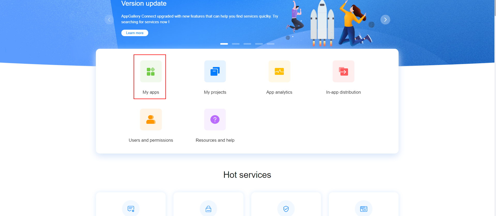
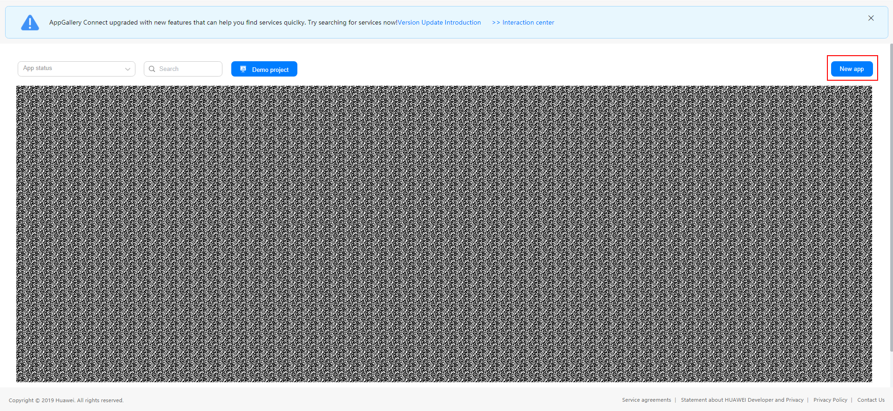
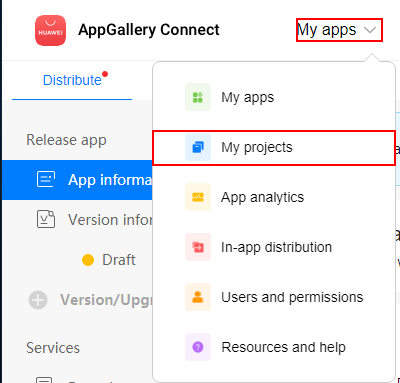
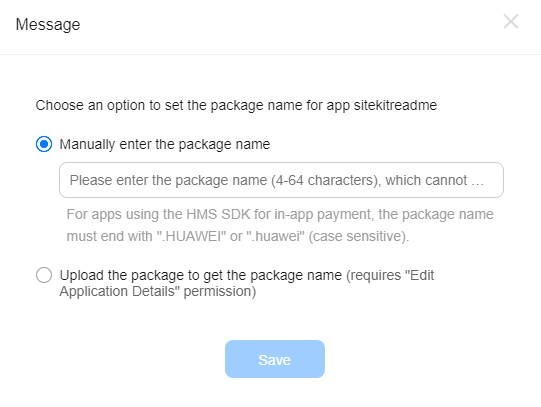
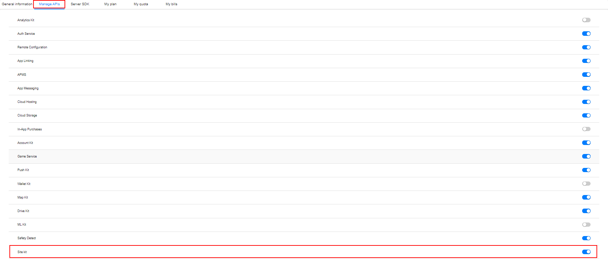
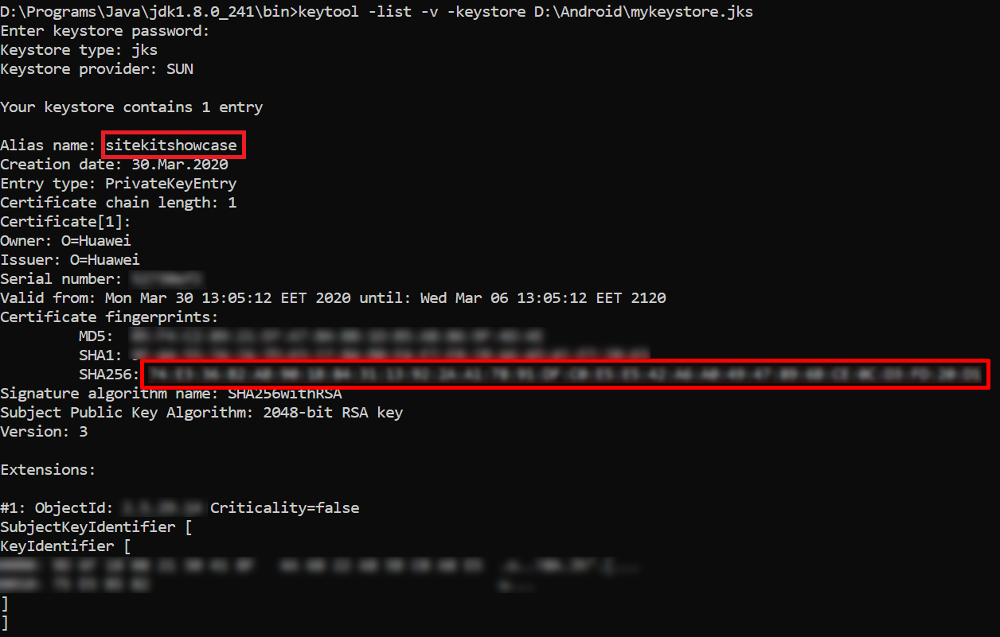
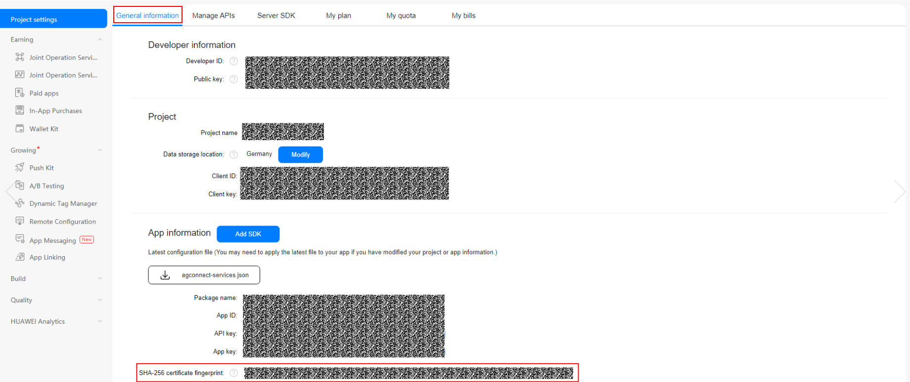

# React-Native HMS site

## Contents
1. [Introduction](#1-introduction)
2. [Installation Guide](#2-installation-guide)
3. [API Reference](#3-api-reference)
4. [Object Description](#4-object-description)
5. [Sample Project](#5-sample-project)
6. [Questions or Issues](#6-questions-or-issues)
7. [Configuration and Description](#7-configuration-and-description)
8. [Licensing and Terms](#8-licensing-and-terms)

## 1. Introduction

This module enables communication between Huawei Site SDK and React Native platform. It exposes all functionality provided by Huawei Site SDK.

## 2. Installation Guide

- Download the module and copy it into **node_modules/@hmscore folder**. The folder structure can be seen below;

```
project-name
    |_ node_modules
        |_ ...
        |_ @hmscore
            |_react-native-hms-site
            |_ ...
        |_ ...
```

- Visit [Huawei developers website](https://developer.huawei.com/consumer/en/) and login to the Huawei developer console, if you don't have a developer account, register for one.
  
- Go to **AppGallery Connect > My Apps > New App**. Create your application.





- Go to **My projects** as shown.


- Enter a package name for your application.



- Navigate to the **General Information** tab. Set the data storage location and download **agconnect-services.json** file and put it under **android/app** folder of your application.


- Click on the **Manage APIs** tab, you will see the list of the enabled and disabled Huawei APIs for your application. Make sure the site kit API is enabled.



- Generate a keystore file and put it in **android/app** folder. To generate a keystore file follow the instructions in [codelabs](https://developer.huawei.com/consumer/en/codelab/HMSPreparation/index.html#3). Place the generated keystore file in **android/app**.
  
- Run the cmd command to open the command line tool and run the cd command to go to the directory where keytool.exe is located, which is the bin directory of the JDK. In the following example, the Java program is installed in Program Files in the C drive.

```console
C:\>cd C:\Program Files\Java\jdk1.8.0_241\bin
C:\Program Files\Java\jdk1.8.0_241\bin>
```

- Run the command:
```console
keytool -list -v -keystore <keystore-file>
```
In the preceding command, \<keystore-file\> is the complete path to the app's signature file. For example, if the keystore file directory is under the path
**D: project-dir\android\app\mykeystore.jks**, the command you would type would be: 
```console
keytool -list -v -keystore project.dir\android\app\keystore.jks
```
- Enter your keystore password as prompted and obtain SHA256 fingerprint from the result. An example of the result is as follows:



- Visit your developer console, and select your project from **My projects**. Navigate to the **General Information** tab. Copy and paste the SHA256 key you obtained in the preceeding step.



- Add following lines into **android/settings.gradle** file
```groovy
include ':react-native-hms-site'
project(':react-native-hms-site').projectDir = new File(rootProject.projectDir, '../node_modules/@hmscore/react-native-hms-site/android')
```

- Add maven repository address to the **buildscript>repositories** and **allprojects>repositories** in **android/build.gradle** file.

```groovy
buildscript {
       repositories {
           ...
           maven {url 'https://developer.huawei.com/repo/'}
       }
}  
allprojects {
       repositories {
           ...
           maven {url 'https://developer.huawei.com/repo/'}
       }
}
```

- Add the agconnect dependency to **buildscript > dependencies** in **android/build.gradle** file.

```groovy
buildscript {
    ...
    dependencies {
        classpath 'com.huawei.agconnect:agcp:1.4.1.300'
    }
    ...
}
```

- Add AppGallery Connect plugin and **react-native-hms-site** dependency into **android/app/build.gradle** file.

```groovy
apply plugin: 'com.huawei.agconnect'
...
dependencies{
    implementation project(":react-native-hms-site")
}
...
```

- In the **android/app/build.gradle** file, Set the value of the field **applicationId** to the value of the field **package_name** in the agconnect-services.json file.

```groovy
android {
    ...
    defaultConfig {
        applicationId "<package_name>"
        minSdkVersion rootProject.ext.minSdkVersion
        targetSdkVersion rootProject.ext.targetSdkVersion
        versionCode 1
        versionName "1.0"
    }
    ...
}
```

- Put keystore file under **android/app** folder. Add signing configuration into **android/app/build.gradle** file.

```groovy
signingConfigs {
        release {
            storeFile file('<keystore>')
            storePassword '<storePassword>'
            keyAlias '<keyAlias>'
            keyPassword '<keyPassword>'
        }

        debug {
            storeFile file('<keystore>')
            storePassword '<storePassword>'
            keyAlias '<keyAlias>'
            keyPassword '<keyPassword>'
        }
    }
    buildTypes {
        debug {
            signingConfig signingConfigs.debug
        }
        release {
            signingConfig signingConfigs.release
            minifyEnabled enableProguardInReleaseBuilds
            proguardFiles getDefaultProguardFile("proguard-android.txt"), "proguard-rules.pro"
        }
    }
    ...
```

- Add **RNHMSSitePackage** to your application.

```java
import com.huawei.hms.rn.site.RNHMSSitePackage;
...
@Override
protected List<ReactPackage> getPackages() {
  @SuppressWarnings("UnnecessaryLocalVariable")
  List<ReactPackage> packages = new PackageList(this).getPackages();
  packages.add(new RNHMSSitePackage());
  return packages;
}
...
```

## 3. API Reference

### RNHMSSite

#### Public Method Summary

|Method|Return Type| Description           |
|:--------------------------------------|:----------|:-------------------------------------------------------|
|initializeService(config)              |Promise\<null>           | Initializes other methods to be used.                                |
|textSearch(textSearchRequest)          |Promise\<[TextSearchResponse](#textsearchresponse) \| [SearchStatus](#searchstatus)>           | Searches for places such as tourist attractions, enterprises, and schools by a TextSearchResponse object.
|querySuggestion(querySuggestionRequest)|Promise\<[QuerySuggestionResponse](#querysuggestionresponse) \| [SearchStatus](#searchstatus)>           | Searches for place details based the unique ID (SiteId) of a place by a QuerySuggestionResponse object.                 |
|nearbySearch(nearbySearchRequest)      |Promise\<[NearbySearchResponse](#nearbysearchresponse) \| [SearchStatus](#searchstatus)>           |Based on the user's current location, searches for nearby places  by a NearbySearchRequest object.             |
|detailSearch(detailSearchRequest)              |Promise\<[DetailSearchResponse](#detailsearchresponse) \| [SearchStatus](#searchstatus)>           | Searches for place details based the unique ID (SiteId) of a place by a DetailSearchRequest object.                                |
|createSearchWidget(searchWidgetConfig) |Promise\<[Site](#site)>           | Creates a search widget by a SearchWidgetConfig, when the user enters a keyword in the search box, the widget displays a list of suggested places to the user.                     |
|RNHMSSite.enableLogger()               |Promise\<null>           | This method enables HMSLogger capability which is used for sending usage analytics of Site SDK's methods to improve the service quality.                                      |
|RNHMSSite.disableLogger()              |Promise\<null>           | This method disables HMSLogger capability which is used for sending usage analytics of Site SDK's methods to improve the service quality.                              |

#### Public Methods

##### RNHMSSite.initializeService(config)
Initializes other methods to be used. It returns a Promise object indicating whether the initialization is successful or not.

###### Parameters

|Name  |Description|
|:-----|:----------|
|config|[Config](#config) object contains the API key to be used for initializing the services.|

###### Return Type

|Type  |Description|
|:-----|:----------|
|Promise\<null>|The method resolves or rejects a null promise depending on the success or failure of the service initialization.|

###### Call Example
```javascript
const config = {
  apiKey: '<api_key>',
};

RNHMSSite.initializeService(config)
  .then(() => {
    console.log('Service is initialized successfully');
  })
  .catch((err) => {
    console.log('Error : ' + err);
  });
```

##### RNHMSSite.textSearch(textSearchRequest)
Searches for places such as tourist attractions, enterprises, and schools based on a TextSearchRequest object. This method takes a TextSearchRequest object as a parameter and returns a Promise object. The Promise object contains a TextSearchResponse object if the search is successful, and a SearchStatus object otherwise.

###### Parameters

|Name|Description|
|:-----|:----------|
|textSearchRequest|[TextSearchRequest](#textsearchrequest) object contains the data to be used to perform a text search.|

###### Return Type

|Type  |Description|
|:-----|:----------|
|Promise\<[TextSearchResponse](#textsearchresponse) \| [SearchStatus](#searchstatus)>|If the search is successful, the method resolves a TextSearchResponse object as the search result. It rejects a SearchStatus object if the search is failed.|

###### Call Example
```javascript
  let textSearchReq = {
    query: "Paris",
    location: {
      lat: 48.893478,
      lng: 2.334595,
    },
    radius: 1000,
    countryCode: 'FR',
    language: 'fr',
    pageIndex: 1,
    pageSize: 5,
    hwPoiType: RNHMSSite.HwLocationType.RESTAURANT,
    poiType: RNHMSSite.LocationType.GYM,
    politicalView: "FR"
  };
  RNHMSSite.textSearch(textSearchReq)
    .then((res) => {
      alert(JSON.stringify(res));
      console.log(JSON.stringify(res));
    })
    .catch((err) => {
      alert(JSON.stringify(err));
      console.log(JSON.stringify(err));
    });
```

##### RNHMSSite.detailSearch(detailSearchRequest)
Searches for place details based the unique ID (SiteId) of a place. This method takes a DetailSearchRequest object as a parameter and returns a Promise object. The Promise object contains a DetailSearchResponse object if the search is successful, or a SearchStatus object otherwise.

###### Parameters

|Name|Description|
|:-----|:----------|
|detailSearchRequest|[DetailSearchRequest](#detailsearchrequest) object contains the data to be used to perform a detail search.|

###### Return Type

|Type  |Description|
|:-----|:----------|
|Promise\<[DetailSearchResponse](#detailsearchresponse) \| [SearchStatus](#searchstatus)>|If successful the method resolves a Promise object encapsulating the DetailSearchResponse object as the search result. The method rejects a SearchStatus object if the search is failed.|

###### Call Example
```javascript
  let detailSearchReq = {
    siteId: '16DA89C6962A36CB1752A343ED48B78A',
    language: 'fr',
    politicalView: 'fr'
  };
  RNHMSSite.detailSearch(detailSearchReq)
    .then((res) => {
      alert(JSON.stringify(res));
      console.log(JSON.stringify(res));
    })
    .catch((err) => {
      alert(JSON.stringify(err));
      console.log(JSON.stringify(err));
    });
```

##### RNHMSSite.querySuggestion(querySuggestionRequest)
Returns suggested places during user input. This method takes a QuerySuggestionRequest object as a parameter and returns a Promise object. The Promise object contains a QuerySuggestionResponse object if the search is successful, and a SearchStatus object otherwise.

###### Parameters

|Name|Description|
|:-----|:----------|
|querySuggestionRequest|[QuerySuggestionRequest](#querysuggestionrequest) object contains the data to be used to get query search suggestions.|

###### Return Type

|Type  |Description|
|:-----|:----------|
|Promise\<[QuerySearchResponse](#querysuggestionresponse) \| [SearchStatus](#searchstatus)>|If successful the method resolves a Promise object encapsulating the QuerySearchResponse object as the search result. The method rejects a SearchStatus object if the search is failed.|

###### Call Example
```javascript
  let querySuggestionReq = {
    query: 'Paris',
    location: {
      lat: 48.893478,
      lng: 2.334595,
    },
    radius: 1000,
    countryCode: 'FR',
    language: 'fr',
    poiTypes: [RNHMSSite.LocationType.ADDRESS, RNHMSSite.LocationType.GEOCODE],
  };
  RNHMSSite.querySuggestion(querySuggestionReq)
    .then((res) => {
      alert(JSON.stringify(res));
    })
    .catch((err) => {
      alert(JSON.stringify(err));
      console.log(JSON.stringify(err));
    });
```

##### RNHMSSite.nearbySearch(nearbySearchRequest)
Searches for nearby places based on the user's current location. This method takes a NearbySearchRequest object as a parameter and returns a Promise object. The Promise object contains a NearbySearchResponse object if the search is successful, and a SearchStatus object otherwise.

###### Parameters

|Name|Description|
|:-----|:----------|
|nearbySearchRequest|[NearbySearchRequest](#nearbysearchrequest) object contains the data to be used to perform a nearby search.|

###### Return Type

|Type  |Description|
|:-----|:----------|
|Promise\<[NearbySearchResponse](#nearbysearchresponse) \| [SearchStatus](#searchstatus)>|If successful the method resolves a Promise object encapsulating the NearbySearchResponse object as the search result. The method rejects a SearchStatus object if the search is failed.|

###### Call Example
```javascript
  let nearbySearchReq = {
    query: 'Paris',
    location:
    {
      lat: 48.893478,
      lng: 2.334595,
    },
    radius: 1000,
    poiType: RNHMSSite.LocationType.ADDRESS,
    countryCode: 'FR',
    language: 'fr',
    pageIndex: 1,
    pageSize: 5,
    hwPoiType: RNHMSSite.HwLocationType.RESTAURANT,
    politicalView: "fr"
  };
  RNHMSSite.nearbySearch(nearbySearchReq)
    .then((res) => {
      alert(JSON.stringify(res));
      console.log(JSON.stringify(res));
    })
    .catch((err) => {
      alert(JSON.stringify(err));
      console.log(JSON.stringify(err));
    });
```

##### RNHMSSite.createSearchWidget(searchWidgetConfig)
Creates a search widget, when a user enters a keyword in the search box, the widget displays a list of suggested places to the user. If the user clicks a place in the list, the app it will return a Site object

###### Parameters

|Name|Description|
|:-----|:----------|
|searchWidgetConfig|[SearchWidgetConfig](#searchwidgetconfig) object contains the necessary fields to create a search widget.|

###### Return Type

|Type  |Description|
|:-----|:----------|
|Promise\<[Site](#site) \| [SearchStatus](#searchstatus)>|If successful the method resolves a Promise object encapsulating the Site object as the search result. The method rejects a SearchStatus object if the search is failed.|

###### Call Example
```javascript
  let params = {
    searchIntent: {
      apiKey: '<api_key>',
      hint: 'myhint',
    },

    searchFilter: {
      query: 'Leeds',
      language: 'en',
    },
  };

  RNHMSSite.createWidget(params)
    .then((res) => {
      alert(JSON.stringify(res));
      console.log(JSON.stringify(res));
    })
    .catch((err) => {
      alert(JSON.stringify(err));
      console.log(JSON.stringify(err));
    });
```

##### RNHMSSite.enableLogger()
This method enables HMSLogger capability which is used for sending usage analytics of Site SDK's methods to improve the service quality.

###### Parameters

None

###### Return Type

|Type  |Description|
|:-----|:----------|
|Promise\<null>|The method resolves or rejects a null promise depending on the success or failure of the enabling logger|

###### Call Example
```javascript
  RNHMSSite.enableLogger()
    .then((res) => {
      alert(JSON.stringify(res));
      console.log(res);
    })
    .catch((err) => {
      alert(JSON.stringify(err));
      console.log(JSON.stringify(err));
    });
```

##### RNHMSSite.disableLogger()
This method disables HMSLogger capability which is used for sending usage analytics of Site SDK's methods to improve the service quality.

###### Parameters

None

###### Return Type

|Type  |Description|
|:-----|:----------|
|Promise\<null>|The method resolves or rejects a null promise depending on the success or failure of the disabling logger|

###### Call Example

```javascript
  RNHMSSite.disableLogger()
    .then((res) => {
      alert(JSON.stringify(res));
      console.log(res);
    })
    .catch((err) => {
      alert(JSON.stringify(err));
      console.log(JSON.stringify(err));
    });
```

##### LocationType
Enumerated place types

|Constant Name  |Description|
|:--------------|:----------|
|RNHMSSite.LocationType.ACCOUNTING|Accounting firm.|
|RNHMSSite.LocationType.ADDRESS|Address.|
|RNHMSSite.LocationType.ADMINISTRATIVE_AREA_LEVEL_1|Level-1 administrative region.|
|RNHMSSite.LocationType.ADMINISTRATIVE_AREA_LEVEL_2|Level-2 administrative region.|
|RNHMSSite.LocationType.ADMINISTRATIVE_AREA_LEVEL_3|Level-3 administrative region.|
|RNHMSSite.LocationType.ADMINISTRATIVE_AREA_LEVEL_4|Level-4 administrative region.|
|RNHMSSite.LocationType.ADMINISTRATIVE_AREA_LEVEL_5|Level-5 administrative region.|
|RNHMSSite.LocationType.AIRPORT|Airport.|
|RNHMSSite.LocationType.AMUSEMENT_PARK|Amusement park.|
|RNHMSSite.LocationType.AQUARIUM|Aquarium.|
|RNHMSSite.LocationType.ARCHIPELAGO|Archipelago.|
|RNHMSSite.LocationType.ART_GALLERY|Art gallery.|
|RNHMSSite.LocationType.ATM|Automatic teller machine (ATM).|
|RNHMSSite.LocationType.BAKERY|Bakery.|
|RNHMSSite.LocationType.BANK|Bank.|
|RNHMSSite.LocationType.BAR|Bar.|
|RNHMSSite.LocationType.BEAUTY_SALON|Beauty salon.|
|RNHMSSite.LocationType.BICYCLE_STORE|Bicycle store.|
|RNHMSSite.LocationType.BOOK_STORE|Bookstore.|
|RNHMSSite.LocationType.BOWLING_ALLEY|Bowling alley.|
|RNHMSSite.LocationType.BUS_STATION|Bus station.|
|RNHMSSite.LocationType.CAFE|Cafe.|
|RNHMSSite.LocationType.CAMPGROUND|Campsite.|
|RNHMSSite.LocationType.CAPITAL|Capital.|
|RNHMSSite.LocationType.CAPITAL_CITY|Capital city.|
|RNHMSSite.LocationType.CAR_DEALER|Automobile dealer.|
|RNHMSSite.LocationType.CAR_RENTAL|Car rental company.|
|RNHMSSite.LocationType.CAR_REPAIR|Vehicle repair plant.|
|RNHMSSite.LocationType.CAR_WASH|Car wash facility.|
|RNHMSSite.LocationType.CASINO|Casino.|
|RNHMSSite.LocationType.CEMETERY|Cemetery.|
|RNHMSSite.LocationType.CHURCH|Church.|
|RNHMSSite.LocationType.CITIES|Cities.|
|RNHMSSite.LocationType.CITY_HALL|City hall.|
|RNHMSSite.LocationType.CLOTHING_STORE|Clothing store.|
|RNHMSSite.LocationType.COLLOQUIAL_AREA|Colloquial area.|
|RNHMSSite.LocationType.CONVENIENCE_STORE|Continent.|
|RNHMSSite.LocationType.CONTINENT|Convenience store.|
|RNHMSSite.LocationType.COUNTRY|Country.|
|RNHMSSite.LocationType.COURTHOUSE|Court.|
|RNHMSSite.LocationType.DENTIST|Dentist.|
|RNHMSSite.LocationType.DEPARTMENT_STORE|Department store.|
|RNHMSSite.LocationType.DOCTOR|Doctor.|
|RNHMSSite.LocationType.DRUGSTORE|Drugstore.|
|RNHMSSite.LocationType.ELECTRICIAN|Electrician.|
|RNHMSSite.LocationType.ELECTRONICS_STORE|E-commerce store.|
|RNHMSSite.LocationType.EMBASSY|Embassy.|
|RNHMSSite.LocationType.ESTABLISHMENT|Establishment.|
|RNHMSSite.LocationType.FINANCE|Financial institution.|
|RNHMSSite.LocationType.FIRE_STATION|Fire station.|
|RNHMSSite.LocationType.FLOOR|Floor.|
|RNHMSSite.LocationType.FLORIST|Florist.|
|RNHMSSite.LocationType.FOOD|Food.|
|RNHMSSite.LocationType.FUNERAL_HOME|Funeral home.|
|RNHMSSite.LocationType.FURNITURE_STORE|Furniture store.|
|RNHMSSite.LocationType.GAS_STATION|Gas station.|
|RNHMSSite.LocationType.GENERAL_CITY|City.|
|RNHMSSite.LocationType.GENERAL_CONTRACTOR|General contractor.|
|RNHMSSite.LocationType.GEOCODE|Geocode.|
|RNHMSSite.LocationType.GROCERY_OR_SUPERMARKET|Grocery or supermarket.|
|RNHMSSite.LocationType.GYM|Gym.|
|RNHMSSite.LocationType.HAMLET|Hair care.|
|RNHMSSite.LocationType.HAIR_CARE|Hamlet.|
|RNHMSSite.LocationType.HARDWARE_STORE|Hardware store.|
|RNHMSSite.LocationType.HEALTH|Health care.|
|RNHMSSite.LocationType.HINDU_TEMPLE|Hindu temple.|
|RNHMSSite.LocationType.HOME_GOODS_STORE|Household goods store.|
|RNHMSSite.LocationType.HOSPITAL|Hospital.|
|RNHMSSite.LocationType.INSURANCE_AGENCY|Insurance company.|
|RNHMSSite.LocationType.INTERSECTION|Intersection.|
|RNHMSSite.LocationType.JEWELRY_STORE|Jewelry store.|
|RNHMSSite.LocationType.LAUNDRY|Laundry room.|
|RNHMSSite.LocationType.LAWYER|Law office.|
|RNHMSSite.LocationType.LIBRARY|Library.|
|RNHMSSite.LocationType.LIGHT_RAIL_STATION|Light rail station.|
|RNHMSSite.LocationType.LIQUOR_STORE|Liquor store.|
|RNHMSSite.LocationType.LOCALITY|Local government office.|
|RNHMSSite.LocationType.LOCAL_GOVERNMENT_OFFICE|Locality.|
|RNHMSSite.LocationType.LOCKSMITH|Locksmith.|
|RNHMSSite.LocationType.LODGING|Lodging.|
|RNHMSSite.LocationType.MEAL_DELIVERY|Food delivery.|
|RNHMSSite.LocationType.MEAL_TAKEAWAY|Takeout.|
|RNHMSSite.LocationType.MOSQUE|Mosque.|
|RNHMSSite.LocationType.MOVIE_RENTAL|Movie rental store.|
|RNHMSSite.LocationType.MOVIE_THEATER|Movie theater.|
|RNHMSSite.LocationType.MOVING_COMPANY|Moving company.|
|RNHMSSite.LocationType.MUSEUM|Museum.|
|RNHMSSite.LocationType.NATURAL_FEATURE|Natural feature.|
|RNHMSSite.LocationType.NEIGHBORHOOD|Neighborhood.|
|RNHMSSite.LocationType.NIGHT_CLUB|Nightclub.|
|RNHMSSite.LocationType.OTHER|Others.|
|RNHMSSite.LocationType.PAINTER|Painter.|
|RNHMSSite.LocationType.PARK|Park.|
|RNHMSSite.LocationType.PARKING|Parking lot.|
|RNHMSSite.LocationType.PET_STORE|Pet store.|
|RNHMSSite.LocationType.PHARMACY|Pharmacy.|
|RNHMSSite.LocationType.PHYSIOTHERAPIST|Physical therapist.|
|RNHMSSite.LocationType.PLACE_OF_WORSHIP|Place of worship.|
|RNHMSSite.LocationType.PLUMBER|Plumber.|
|RNHMSSite.LocationType.POINT_OF_INTEREST|Point of interest (POI).|
|RNHMSSite.LocationType.POLICE|Police.|
|RNHMSSite.LocationType.POLITICAL|Political place.|
|RNHMSSite.LocationType.POSTAL_CODE|Postal code.|
|RNHMSSite.LocationType.POSTAL_CODE_PREFIX|Postal code prefix.|
|RNHMSSite.LocationType.POSTAL_CODE_SUFFIX|Postal code suffix.|
|RNHMSSite.LocationType.POSTAL_TOWN|Postal town.|
|RNHMSSite.LocationType.POST_BOX|Mailbox.|
|RNHMSSite.LocationType.POST_OFFICE|Post office.|
|RNHMSSite.LocationType.PREMISE|Premises.|
|RNHMSSite.LocationType.PRIMARY_SCHOOL|Primary school.|
|RNHMSSite.LocationType.REAL_ESTATE_AGENCY|Real estate agency.|
|RNHMSSite.LocationType.REGION|Region.|
|RNHMSSite.LocationType.REGIONS|Regions.|
|RNHMSSite.LocationType.RESTAURANT|Restaurant.|
|RNHMSSite.LocationType.ROOFING_CONTRACTOR|Roofing contractor.|
|RNHMSSite.LocationType.ROOM|Room.|
|RNHMSSite.LocationType.ROUTE|Route.|
|RNHMSSite.LocationType.RV_PARK|Recreational vehicle park.|
|RNHMSSite.LocationType.SCHOOL|School.|
|RNHMSSite.LocationType.SECONDARY_SCHOOL|Secondary school.|
|RNHMSSite.LocationType.SHOE_STORE|Shoe store.|
|RNHMSSite.LocationType.SHOPPING_MALL|Shopping mall.|
|RNHMSSite.LocationType.SPA|Spa.|
|RNHMSSite.LocationType.STADIUM|Stadium.|
|RNHMSSite.LocationType.STORAGE|Storage.|
|RNHMSSite.LocationType.STORE|Store.|
|RNHMSSite.LocationType.STREET_ADDRESS|Street address.|
|RNHMSSite.LocationType.STREET_NUMBER|Street number.|
|RNHMSSite.LocationType.SUBLOCALITY|Sub-locality.|
|RNHMSSite.LocationType.SUBLOCALITY_LEVEL_1|Level-1 sub-locality.|
|RNHMSSite.LocationType.SUBLOCALITY_LEVEL_2|Level-2 sub-locality.|
|RNHMSSite.LocationType.SUBLOCALITY_LEVEL_3|Level-3 sub-locality.|
|RNHMSSite.LocationType.SUBLOCALITY_LEVEL_4|Level-4 sub-locality.|
|RNHMSSite.LocationType.SUBLOCALITY_LEVEL_5|Level-5 sub-locality.|
|RNHMSSite.LocationType.SUBPREMISE|Sub-premises.|
|RNHMSSite.LocationType.SUBWAY_STATION|Subway station.|
|RNHMSSite.LocationType.SUPERMARKET|Supermarket.|
|RNHMSSite.LocationType.SYNAGOGUE|Synagogue.|
|RNHMSSite.LocationType.TAXI_STAND|Taxi stand.|
|RNHMSSite.LocationType.TOURIST_ATTRACTION|Tourist attraction.|
|RNHMSSite.LocationType.TOWN|Town.|
|RNHMSSite.LocationType.TOWN_SQUARE|Town square.|
|RNHMSSite.LocationType.TRAIN_STATION|Railway station.|
|RNHMSSite.LocationType.TRANSIT_STATION|Transit station.|
|RNHMSSite.LocationType.TRAVEL_AGENCY|Travel agency.|
|RNHMSSite.LocationType.UNIVERSITY|University.|
|RNHMSSite.LocationType.VETERINARY_CARE|Veterinary care.|
|RNHMSSite.LocationType.ZOO|Zoo.|


##### HwLocationType
Enumerated Huawei place types.

|Constant Name  | Description |
|:--------------|:------|
|RNHMSSite.HwLocationType.ACCESS_GATEWAY|Access gateway.|
|RNHMSSite.HwLocationType.ADDRESS|Address.|
|RNHMSSite.HwLocationType.ADMIN_FEATURE|Admin feature.|
|RNHMSSite.HwLocationType.ADMINISTRATIVE_AREA_LEVEL_1|Level-1 administrative region.|
|RNHMSSite.HwLocationType.ADMINISTRATIVE_AREA_LEVEL_2|Level-2 administrative region.|
|RNHMSSite.HwLocationType.ADMINISTRATIVE_AREA_LEVEL_3|Level-3 administrative region.|
|RNHMSSite.HwLocationType.ADMINISTRATIVE_AREA_LEVEL_4|Level-4 administrative region.|
|RNHMSSite.HwLocationType.ADVENTURE_SPORTS_VENUE|Adventure sports venue.|
|RNHMSSite.HwLocationType.ADVENTURE_VEHICLE_TRAIL|Adventure vehicle trail.|
|RNHMSSite.HwLocationType.ADVERTISING_AND_MARKETING_COMPANY|Advertising and marketing company.|
|RNHMSSite.HwLocationType.AFGHAN_RESTAURANT|Afghan restaurant.|
|RNHMSSite.HwLocationType.AFRICAN_RESTAURANT|African restaurant.|
|RNHMSSite.HwLocationType.AGRICULTURAL_SUPPLY_STORE|Agricultural supply store.|
|RNHMSSite.HwLocationType.AGRICULTURAL_TECHNOLOGY_COMPANY|Agricultural technology company.|
|RNHMSSite.HwLocationType.AGRICULTURE_BUSINESS|Agriculture business.|
|RNHMSSite.HwLocationType.AIRFIELD|Airfield.|
|RNHMSSite.HwLocationType.AIRLINE|Airline.|
|RNHMSSite.HwLocationType.AIRLINE_ACCESS|Airline access.|
|RNHMSSite.HwLocationType.AIRPORT|Airport.|
|RNHMSSite.HwLocationType.ALGERIAN_RESTAURANT|Algerian restaurant.|
|RNHMSSite.HwLocationType.AMBULANCE_UNIT|Ambulance unit.|
|RNHMSSite.HwLocationType.AMERICAN_RESTAURANT|American restaurant.|
|RNHMSSite.HwLocationType.AMPHITHEATER|Amphitheater.|
|RNHMSSite.HwLocationType.AMUSEMENT_ARCADE|Amusement arcade.|
|RNHMSSite.HwLocationType.AMUSEMENT_PARK|Amusement park.|
|RNHMSSite.HwLocationType.AMUSEMENT_PLACE|Amusement place.|
|RNHMSSite.HwLocationType.ANIMAL_SERVICE_STORE|Animal service store.|
|RNHMSSite.HwLocationType.ANIMAL_SHELTER|Animal shelter.|
|RNHMSSite.HwLocationType.ANTIQUE_ART_STORE|Antique art store.|
|RNHMSSite.HwLocationType.APARTMENT|Apartment.|
|RNHMSSite.HwLocationType.AQUATIC_ZOO_MARINE_PARK|Aquatic zoo marine park.|
|RNHMSSite.HwLocationType.ARABIAN_RESTAURANT|Arabian restaurant.|
|RNHMSSite.HwLocationType.ARBORETA_BOTANICAL_GARDENS|Arboreta botanical gardens.|
|RNHMSSite.HwLocationType.ARCH|Arch.|
|RNHMSSite.HwLocationType.ARGENTINEAN_RESTAURANT|Argentinean restaurant.|
|RNHMSSite.HwLocationType.ARMENIAN_RESTAURANT|Armenian restaurant.|
|RNHMSSite.HwLocationType.ART_MUSEUM|Art museum.|
|RNHMSSite.HwLocationType.ART_SCHOOL|Art school.|
|RNHMSSite.HwLocationType.ASHRAM|Ashram.|
|RNHMSSite.HwLocationType.ASIAN_RESTAURANT|Asian restaurant.|
|RNHMSSite.HwLocationType.ATHLETIC_STADIUM|Athletic stadium.|
|RNHMSSite.HwLocationType.ATV_SNOWMOBILE_DEALER|Atv snowmobile dealer.|
|RNHMSSite.HwLocationType.AUSTRALIAN_RESTAURANT|Australian restaurant.|
|RNHMSSite.HwLocationType.AUSTRIAN_RESTAURANT|Austrian restaurant.|
|RNHMSSite.HwLocationType.AUTOMATIC_TELLER_MACHINE|Automatic teller machine.|
|RNHMSSite.HwLocationType.AUTOMOBILE_ACCESSORIES_SHOP|Automobile accessories shop.|
|RNHMSSite.HwLocationType.AUTOMOBILE_COMPANY|Automobile company.|
|RNHMSSite.HwLocationType.AUTOMOBILE_MANUFACTURING_COMPANY|Automobile manufacturing company.|
|RNHMSSite.HwLocationType.AUTOMOTIVE|Automotive.|
|RNHMSSite.HwLocationType.AUTOMOTIVE_DEALER|Automotive dealer.|
|RNHMSSite.HwLocationType.AUTOMOTIVE_GLASS_REPLACEMENT_SHOP|Automotive glass replacement shop.|
|RNHMSSite.HwLocationType.AUTOMOTIVE_REPAIR_SHOP|Automotive repair shop.|
|RNHMSSite.HwLocationType.BADMINTON_COURT|Badminton court.|
|RNHMSSite.HwLocationType.BAGS_LEATHERWEAR_SHOP|Bags leatherwear shop.|
|RNHMSSite.HwLocationType.BAKERY|Bakery.|
|RNHMSSite.HwLocationType.BANK|Bank.|
|RNHMSSite.HwLocationType.BANQUET_ROOM|Banquet room.|
|RNHMSSite.HwLocationType.BAR|Bar.|
|RNHMSSite.HwLocationType.BARBECUE_RESTAURANT|Barbecue restaurant.|
|RNHMSSite.HwLocationType.BASEBALL_FIELD|Baseball field.|
|RNHMSSite.HwLocationType.BASKETBALL_COURT|Basketball court.|
|RNHMSSite.HwLocationType.BASQUE_RESTAURANT|Basque restaurant.|
|RNHMSSite.HwLocationType.BATTLEFIELD|Battlefield.|
|RNHMSSite.HwLocationType.BAY|Bay.|
|RNHMSSite.HwLocationType.BEACH|Beach.|
|RNHMSSite.HwLocationType.BEACH_CLUB|Beach club.|
|RNHMSSite.HwLocationType.BEAUTY_SALON|Beauty salon.|
|RNHMSSite.HwLocationType.BEAUTY_SUPPLY_SHOP|Beauty supply shop.|
|RNHMSSite.HwLocationType.BED_BREAKFAST_GUEST_HOUSES|Bed breakfast guest houses.|
|RNHMSSite.HwLocationType.BELGIAN_RESTAURANT|Belgian restaurant.|
|RNHMSSite.HwLocationType.BETTING_STATION|Betting station.|
|RNHMSSite.HwLocationType.BICYCLE_PARKING_PLACE|Bicycle parking place.|
|RNHMSSite.HwLocationType.BICYCLE_SHARING_LOCATION|Bicycle sharing location.|
|RNHMSSite.HwLocationType.BILLIARDS_POOL_HALL|Billiards pool hall.|
|RNHMSSite.HwLocationType.BISTRO|Bistro.|
|RNHMSSite.HwLocationType.BLOOD_BANK|Blood bank.|
|RNHMSSite.HwLocationType.BOAT_DEALER|Boat dealer.|
|RNHMSSite.HwLocationType.BOAT_FERRY|Boat ferry.|
|RNHMSSite.HwLocationType.BOAT_LAUNCHING_RAMP|Boat launching ramp.|
|RNHMSSite.HwLocationType.BOATING_EQUIPMENT_ACCESSORIES_STORE|Boating equipment accessories store.|
|RNHMSSite.HwLocationType.BODYSHOPS|Bodyshops.|
|RNHMSSite.HwLocationType.BOLIVIAN_RESTAURANT|Bolivian restaurant.|
|RNHMSSite.HwLocationType.BOOKSTORE|Bookstore.|
|RNHMSSite.HwLocationType.BORDER_POST|Border post.|
|RNHMSSite.HwLocationType.BOSNIAN_RESTAURANT|Bosnian restaurant.|
|RNHMSSite.HwLocationType.BOWLING_FIELD|Bowling field.|
|RNHMSSite.HwLocationType.BRAZILIAN_RESTAURANT|Brazilian restaurant.|
|RNHMSSite.HwLocationType.BRIDGE|Bridge.|
|RNHMSSite.HwLocationType.BRIDGE_TUNNEL_ENGINEERING_COMPANY|Bridge tunnel engineering company.|
|RNHMSSite.HwLocationType.BRITISH_RESTAURANT|British restaurant.|
|RNHMSSite.HwLocationType.BUDDHIST_TEMPLE|Buddhist temple.|
|RNHMSSite.HwLocationType.BUFFET|Buffet.|
|RNHMSSite.HwLocationType.BUILDING|Building.|
|RNHMSSite.HwLocationType.BULGARIAN_RESTAURANT|Bulgarian restaurant.|
|RNHMSSite.HwLocationType.BUNGALOW|Bungalow.|
|RNHMSSite.HwLocationType.BURMESE_RESTAURANT|Burmese restaurant.|
|RNHMSSite.HwLocationType.BUS_CHARTER_RENTAL_COMPANY|Bus charter rental company.|
|RNHMSSite.HwLocationType.BUS_COMPANY|Bus company.|
|RNHMSSite.HwLocationType.BUS_DEALER|Bus dealer.|
|RNHMSSite.HwLocationType.BUS_STOP|Bus stop.|
|RNHMSSite.HwLocationType.BUSINESS|Business.|
|RNHMSSite.HwLocationType.BUSINESS_PARK|Business park.|
|RNHMSSite.HwLocationType.BUSINESS_SERVICES_COMPANY|Business services company.|
|RNHMSSite.HwLocationType.CABARET|Cabaret.|
|RNHMSSite.HwLocationType.CABINS_LODGES|Cabins lodges.|
|RNHMSSite.HwLocationType.CABLE_TELEPHONE_COMPANY|Cable telephone company.|
|RNHMSSite.HwLocationType.CAFE|Cafe.|
|RNHMSSite.HwLocationType.CAFE_PUB|Cafe pub.|
|RNHMSSite.HwLocationType.CAFETERIA|Cafeteria.|
|RNHMSSite.HwLocationType.CALIFORNIAN_RESTAURANT|Californian restaurant.|
|RNHMSSite.HwLocationType.CAMBODIAN_RESTAURANT|Cambodian restaurant.|
|RNHMSSite.HwLocationType.CAMPING_GROUND|Camping ground.|
|RNHMSSite.HwLocationType.CANADIAN_RESTAURANT|Canadian restaurant.|
|RNHMSSite.HwLocationType.CAPE|Cape.|
|RNHMSSite.HwLocationType.CAPITAL|Capital.|
|RNHMSSite.HwLocationType.CAPITAL_CITY|Capital city.|
|RNHMSSite.HwLocationType.CAR_CLUB|Car club.|
|RNHMSSite.HwLocationType.CAR_DEALER|Car dealer.|
|RNHMSSite.HwLocationType.CAR_RENTAL|Car rental.|
|RNHMSSite.HwLocationType.CAR_RENTAL_COMPANY|Car rental company.|
|RNHMSSite.HwLocationType.CAR_WASH|Car wash.|
|RNHMSSite.HwLocationType.CAR_WASH_SUB|Car wash sub.|
|RNHMSSite.HwLocationType.CARAVAN_SITE|Caravan site.|
|RNHMSSite.HwLocationType.CARGO_CENTER|Cargo center.|
|RNHMSSite.HwLocationType.CARIBBEAN_RESTAURANT|Caribbean restaurant.|
|RNHMSSite.HwLocationType.CARPET_FLOOR_COVERING_STORE|Carpet floor covering store.|
|RNHMSSite.HwLocationType.CASINO|Casino.|
|RNHMSSite.HwLocationType.CATERING_COMPANY|Catering company.|
|RNHMSSite.HwLocationType.CAVE|Cave.|
|RNHMSSite.HwLocationType.CD_DVD_VIDEO_RENTAL_STORE|Cd-dvd video rental store.|
|RNHMSSite.HwLocationType.CD_DVD_VIDEO_STORE|Cd-dvd video store.|
|RNHMSSite.HwLocationType.CD_DVD_VIDEO_STORE_SUB|Cd-dvd video store sub.|
|RNHMSSite.HwLocationType.CEMETERY|Cemetery.|
|RNHMSSite.HwLocationType.CHALET|Chalet.|
|RNHMSSite.HwLocationType.CHEMICAL_COMPANY|Chemical company.|
|RNHMSSite.HwLocationType.CHICKEN_RESTAURANT|Chicken restaurant.|
|RNHMSSite.HwLocationType.CHILD_CARE_FACILITY|Child care facility.|
|RNHMSSite.HwLocationType.CHILDRENS_MUSEUM|Childrens museum.|
|RNHMSSite.HwLocationType.CHILEAN_RESTAURANT|Chilean restaurant.|
|RNHMSSite.HwLocationType.CHINESE_MEDICINE_HOSPITAL|Chinese medicine hospital.|
|RNHMSSite.HwLocationType.CHINESE_RESTAURANT|Chinese restaurant.|
|RNHMSSite.HwLocationType.CHRISTMAS_HOLIDAY_STORE|Christmas holiday store.|
|RNHMSSite.HwLocationType.CHURCH|Church.|
|RNHMSSite.HwLocationType.CINEMA|Cinema.|
|RNHMSSite.HwLocationType.CINEMA_SUB|Cinema sub.|
|RNHMSSite.HwLocationType.CITIES|Cities.|
|RNHMSSite.HwLocationType.CITY_CENTER|City center.|
|RNHMSSite.HwLocationType.CITY_HALL|City hall.|
|RNHMSSite.HwLocationType.CIVIC_COMMUNITY_CENTER|Civic community center.|
|RNHMSSite.HwLocationType.CLEANING_SERVICE_COMPANY|Cleaning service company.|
|RNHMSSite.HwLocationType.CLOTHING_ACCESSORIES_STORE|Clothing accessories store.|
|RNHMSSite.HwLocationType.CLUB_ASSOCIATION|Club association.|
|RNHMSSite.HwLocationType.COACH_PARKING_AREA|Coach parking area.|
|RNHMSSite.HwLocationType.COACH_STATION|Coach station.|
|RNHMSSite.HwLocationType.COCKTAIL_BAR|Cocktail bar.|
|RNHMSSite.HwLocationType.COFFEE_SHOP|Coffee shop.|
|RNHMSSite.HwLocationType.COLLEGE_UNIVERSITY|College university.|
|RNHMSSite.HwLocationType.COLOMBIAN_RESTAURANT|Colombian restaurant.|
|RNHMSSite.HwLocationType.COMEDY_CLUB|Comedy club.|
|RNHMSSite.HwLocationType.COMMERCIAL_BUILDING|Commercial building.|
|RNHMSSite.HwLocationType.COMMUNITY_CENTER|Community center.|
|RNHMSSite.HwLocationType.COMPANY|Company.|
|RNHMSSite.HwLocationType.COMPUTER_AND_DATA_SERVICES_CORPORATION|Computer and data services corporation.|
|RNHMSSite.HwLocationType.COMPUTER_SOFTWARE_COMPANY|Computer software company.|
|RNHMSSite.HwLocationType.COMPUTER_STORE|Computer store.|
|RNHMSSite.HwLocationType.CONCERT_HALL|Concert hall.|
|RNHMSSite.HwLocationType.CONDOMINIUM_COMPLEX|Condominium complex.|
|RNHMSSite.HwLocationType.CONSTRUCTION_COMPANY|Construction company.|
|RNHMSSite.HwLocationType.CONSTRUCTION_MATERIAL_EQUIPMENT_SHOP|Construction material equipment shop.|
|RNHMSSite.HwLocationType.CONSUMER_ELECTRONICS_STORE|Consumer electronics store.|
|RNHMSSite.HwLocationType.CONTINENT|Continent.|
|RNHMSSite.HwLocationType.CONVENIENCE_STORE|Convenience store.|
|RNHMSSite.HwLocationType.CORSICAN_RESTAURANT|Corsican restaurant.|
|RNHMSSite.HwLocationType.COTTAGE|Cottage.|
|RNHMSSite.HwLocationType.COUNTRY|Country.|
|RNHMSSite.HwLocationType.COUNTY|County.|
|RNHMSSite.HwLocationType.COUNTY_COUNCIL|County council.|
|RNHMSSite.HwLocationType.COURIER_DROP_BOX|Courier drop box.|
|RNHMSSite.HwLocationType.COURTHOUSE|Courthouse.|
|RNHMSSite.HwLocationType.COVE|Cove.|
|RNHMSSite.HwLocationType.CREOLE_CAJUN_RESTAURANT|Creole cajun restaurant.|
|RNHMSSite.HwLocationType.CREPERIE|Creperie.|
|RNHMSSite.HwLocationType.CRICKET_GROUND|Cricket ground.|
|RNHMSSite.HwLocationType.CUBAN_RESTAURANT|Cuban restaurant.|
|RNHMSSite.HwLocationType.CULINARY_SCHOOL|Culinary school.|
|RNHMSSite.HwLocationType.CULTURAL_CENTER|Cultural center.|
|RNHMSSite.HwLocationType.CURRENCY_EXCHANGE|Currency exchange.|
|RNHMSSite.HwLocationType.CURTAIN_TEXTILE_STORE|Curtain textile store.|
|RNHMSSite.HwLocationType.CYPRIOT_RESTAURANT|Cypriot restaurant.|
|RNHMSSite.HwLocationType.CZECH_RESTAURANT|Czech restaurant.|
|RNHMSSite.HwLocationType.DAM|Dam.|
|RNHMSSite.HwLocationType.DANCE_STUDIO_SCHOOL|Dance studio school.|
|RNHMSSite.HwLocationType.DANCING_CLUB|Dancing club.|
|RNHMSSite.HwLocationType.DANISH_RESTAURANT|Danish restaurant.|
|RNHMSSite.HwLocationType.DELICATESSEN_STORE|Delicatessen store.|
|RNHMSSite.HwLocationType.DELIVERY_ENTRANCE|Delivery entrance.|
|RNHMSSite.HwLocationType.DENTAL_CLINIC|Dental clinic.|
|RNHMSSite.HwLocationType.DEPARTMENT_STORE|Department store.|
|RNHMSSite.HwLocationType.DHARMA_TEMPLE|Dharma temple.|
|RNHMSSite.HwLocationType.DINNER_THEATER|Dinner theater.|
|RNHMSSite.HwLocationType.DISCOTHEQUE|Discotheque.|
|RNHMSSite.HwLocationType.DIVERSIFIED_FINANCIAL_SERVICE_COMPANY|Diversified financial service company.|
|RNHMSSite.HwLocationType.DIVING_CENTER|Diving center.|
|RNHMSSite.HwLocationType.DO_IT_YOURSELF_CENTERS|Do it yourself centers.|
|RNHMSSite.HwLocationType.DOCK|Dock.|
|RNHMSSite.HwLocationType.DOMINICAN_RESTAURANT|Dominican restaurant.|
|RNHMSSite.HwLocationType.DONGBEI_RESTAURANT|Dongbei restaurant.|
|RNHMSSite.HwLocationType.DOUGHNUT_SHOP|Doughnut shop.|
|RNHMSSite.HwLocationType.DRIVE_IN_CINEMA|Drive in cinema.|
|RNHMSSite.HwLocationType.DRIVE_THROUGH_BOTTLE_SHOP|Drive through bottle shop.|
|RNHMSSite.HwLocationType.DRIVING_SCHOOL|Driving school.|
|RNHMSSite.HwLocationType.DRUGSTORE|Drugstore.|
|RNHMSSite.HwLocationType.DRY_CLEANERS|Dry cleaners.|
|RNHMSSite.HwLocationType.DUNE|Dune.|
|RNHMSSite.HwLocationType.DUTCH_RESTAURANT|Dutch restaurant.|
|RNHMSSite.HwLocationType.EARTHQUAKE_ASSEMBLY_POINT_|Earthquake assembly point.|
|RNHMSSite.HwLocationType.EATING_DRINKING|Eating drinking.|
|RNHMSSite.HwLocationType.EDUCATION_INSTITUTION|Education institution.|
|RNHMSSite.HwLocationType.EGYPTIAN_RESTAURANT|Egyptian restaurant.|
|RNHMSSite.HwLocationType.ELECTRIC_VEHICLE_CHARGING_STATION|Electric vehicle charging station.|
|RNHMSSite.HwLocationType.ELECTRICAL_APPLIANCE_STORE|Electrical appliance store.|
|RNHMSSite.HwLocationType.ELECTRICAL_APPLIANCE_STORE_SUB|Electrical appliance store sub.|
|RNHMSSite.HwLocationType.ELECTRONICS_COMPANY|Electronics company.|
|RNHMSSite.HwLocationType.ELECTRONICS_STORE|Electronics store.|
|RNHMSSite.HwLocationType.EMBASSY|Embassy.|
|RNHMSSite.HwLocationType.EMERGENCY_ASSEMBLY_POINT|Emergency assembly point.|
|RNHMSSite.HwLocationType.EMERGENCY_MEDICAL_SERVICE_CENTER|Emergency medical service center.|
|RNHMSSite.HwLocationType.EMERGENCY_ROOM|Emergency room.|
|RNHMSSite.HwLocationType.ENGLISH_RESTAURANT|English restaurant.|
|RNHMSSite.HwLocationType.ENTERTAINMENT_CABARET_LIVE|Entertainment cabaret live.|
|RNHMSSite.HwLocationType.ENTERTAINMENT_PLACE|Entertainment place.|
|RNHMSSite.HwLocationType.EQUIPMENT_RENTAL_COMPANY|Equipment rental company.|
|RNHMSSite.HwLocationType.EROTIC_RESTAURANT|Erotic restaurant.|
|RNHMSSite.HwLocationType.ESTABLISHMENT|Establishment.|
|RNHMSSite.HwLocationType.ETHIOPIAN_RESTAURANT|Ethiopian restaurant.|
|RNHMSSite.HwLocationType.EXCHANGE|Exchange.|
|RNHMSSite.HwLocationType.EXHIBITION_CONVENTION_CENTER|Exhibition convention center.|
|RNHMSSite.HwLocationType.EXOTIC_RESTAURANT|Exotic restaurant.|
|RNHMSSite.HwLocationType.FACTORY_OUTLETS|Factory outlets.|
|RNHMSSite.HwLocationType.FAIRGROUND|Fairground.|
|RNHMSSite.HwLocationType.FARM|Farm.|
|RNHMSSite.HwLocationType.FARMER_MARKET|Farmer market.|
|RNHMSSite.HwLocationType.FAST_FOOD_RESTAURANT|Fast food restaurant.|
|RNHMSSite.HwLocationType.FERRY_TERMINAL|Ferry terminal.|
|RNHMSSite.HwLocationType.FILIPINO_RESTAURANT|Filipino restaurant.|
|RNHMSSite.HwLocationType.FINNISH_RESTAURANT|Finnish restaurant.|
|RNHMSSite.HwLocationType.FIRE_ASSEMBLY_POINT|Fire assembly point.|
|RNHMSSite.HwLocationType.FIRE_STATION_BRIGADE|Fire station brigade.|
|RNHMSSite.HwLocationType.FISH_STORE|Fish store.|
|RNHMSSite.HwLocationType.FISHING_HUNTING_AREA|Fishing hunting area.|
|RNHMSSite.HwLocationType.FITNESS_CLUB_CENTER|Fitness club center.|
|RNHMSSite.HwLocationType.FIVE_STAR_HOTEL|Five star hotel.|
|RNHMSSite.HwLocationType.FLATS_APARTMENT_COMPLEX|Flats apartment complex.|
|RNHMSSite.HwLocationType.FLOOD_ASSEMBLY_POINT|Flood assembly point.|
|RNHMSSite.HwLocationType.FLORISTS|Florists.|
|RNHMSSite.HwLocationType.FLYING_CLUB|Flying club.|
|RNHMSSite.HwLocationType.FONDUE_RESTAURANT|Fondue restaurant.|
|RNHMSSite.HwLocationType.FOOD_DRINK_SHOP|Food drink shop.|
|RNHMSSite.HwLocationType.FOOD_MARKET|Food market.|
|RNHMSSite.HwLocationType.FOOTBALL_FIELD|Football field.|
|RNHMSSite.HwLocationType.FOREST_AREA|Forest area.|
|RNHMSSite.HwLocationType.FOUR_STAR_HOTEL|Four star hotel.|
|RNHMSSite.HwLocationType.FRENCH_RESTAURANT|French restaurant.|
|RNHMSSite.HwLocationType.FUNERAL_SERVICE_COMPANY|Funeral service company.|
|RNHMSSite.HwLocationType.FURNITURE_ACCESSORIES_STORE|Furniture accessories store.|
|RNHMSSite.HwLocationType.FURNITURE_STORE|Furniture store.|
|RNHMSSite.HwLocationType.FUSION_RESTAURANT|Fusion restaurant.|
|RNHMSSite.HwLocationType.GALLERY|Gallery.|
|RNHMSSite.HwLocationType.GARDENING_CERVICE_CENTER|Gardening cervice center.|
|RNHMSSite.HwLocationType.GENERAL_AUTO_REPAIR_SERVICE_CENTER|General auto repair service center.|
|RNHMSSite.HwLocationType.GENERAL_CITY|General city.|
|RNHMSSite.HwLocationType.GENERAL_CLINIC|General clinic.|
|RNHMSSite.HwLocationType.GENERAL_HOSPITAL|General hospital.|
|RNHMSSite.HwLocationType.GENERAL_POST_OFFICE|General post office.|
|RNHMSSite.HwLocationType.GEOCODE|Geocode.|
|RNHMSSite.HwLocationType.GEOGRAPHIC_FEATURE|Geographic feature.|
|RNHMSSite.HwLocationType.GERMAN_RESTAURANT|German restaurant.|
|RNHMSSite.HwLocationType.GIFT_STORE|Gift store.|
|RNHMSSite.HwLocationType.GLASS_WINDOW_STORE|Glass window store.|
|RNHMSSite.HwLocationType.GLASSWARE_CERAMIC_SHOP|Glassware ceramic shop.|
|RNHMSSite.HwLocationType.GOLD_EXCHANGE|Gold exchange.|
|RNHMSSite.HwLocationType.GOLF_COURSE|Golf course.|
|RNHMSSite.HwLocationType.GOVERNMENT_OFFICE|Government office.|
|RNHMSSite.HwLocationType.GOVERNMENT_PUBLIC_SERVICE|Government public service.|
|RNHMSSite.HwLocationType.GREEK_RESTAURANT|Greek restaurant.|
|RNHMSSite.HwLocationType.GREENGROCERY|Greengrocery.|
|RNHMSSite.HwLocationType.GRILL|Grill.|
|RNHMSSite.HwLocationType.GROCERY|Grocery.|
|RNHMSSite.HwLocationType.GUANGDONG_RESTAURANT|Guangdong restaurant.|
|RNHMSSite.HwLocationType.GURUDWARA|Gurudwara.|
|RNHMSSite.HwLocationType.HAIR_SALON_BARBERSHOP|Hair salon barbershop.|
|RNHMSSite.HwLocationType.HAMBURGER_RESTAURANT|Hamburger restaurant.|
|RNHMSSite.HwLocationType.HAMLET|Hamlet.|
|RNHMSSite.HwLocationType.HARBOR|Harbor.|
|RNHMSSite.HwLocationType.HARDWARE_STORE|Hardware store.|
|RNHMSSite.HwLocationType.HEALTH_CARE|Health care.|
|RNHMSSite.HwLocationType.HEALTHCARE_SERVICE_CENTER|Healthcare service center.|
|RNHMSSite.HwLocationType.HELIPAD_HELICOPTER_LANDING|Helipad helicopter landing.|
|RNHMSSite.HwLocationType.HIGH_SCHOOL|High school.|
|RNHMSSite.HwLocationType.HIGHWAY__ENTRANCE|Highway entrance.|
|RNHMSSite.HwLocationType.HIGHWAY_EXIT|Highway exit.|
|RNHMSSite.HwLocationType.HIKING_TRAIL|Hiking trail.|
|RNHMSSite.HwLocationType.HILL|Hill.|
|RNHMSSite.HwLocationType.HINDU_TEMPLE|Hindu temple.|
|RNHMSSite.HwLocationType.HISTORIC_SITE|Historic site.|
|RNHMSSite.HwLocationType.HISTORICAL_PARK|Historical park.|
|RNHMSSite.HwLocationType.HISTORY_MUSEUM|History museum.|
|RNHMSSite.HwLocationType.HOBBY_SHOP|Hobby shop.|
|RNHMSSite.HwLocationType.HOCKEY_CLUB|Hockey club.|
|RNHMSSite.HwLocationType.HOCKEY_FIELD|Hockey field.|
|RNHMSSite.HwLocationType.HOLIDAY_HOUSE_RENTAL|Holiday house rental.|
|RNHMSSite.HwLocationType.HOME_APPLIANCE_REPAIR_COMPANY|Home appliance repair company.|
|RNHMSSite.HwLocationType.HOME_GOODS_STORE|Home goods store.|
|RNHMSSite.HwLocationType.HORSE_RACING_TRACK|Horse racing track.|
|RNHMSSite.HwLocationType.HORSE_RIDING_FIELD|Horse riding field.|
|RNHMSSite.HwLocationType.HORSE_RIDING_TRAIL|Horse riding trail.|
|RNHMSSite.HwLocationType.HORTICULTURE_COMPANY|Horticulture company.|
|RNHMSSite.HwLocationType.HOSPITAL_FOR_WOMEN_AND_CHILDREN|Hospital for women and children.|
|RNHMSSite.HwLocationType.HOSPITAL_POLYCLINIC|Hospital polyclinic.|
|RNHMSSite.HwLocationType.HOSTEL|Hostel.|
|RNHMSSite.HwLocationType.HOT_POT_RESTAURANT|Hot pot restaurant.|
|RNHMSSite.HwLocationType.HOTEL|Hotel.|
|RNHMSSite.HwLocationType.HOTEL_MOTEL|Hotel motel.|
|RNHMSSite.HwLocationType.HOTELS_WITH_LESS_THAN_TWO_STARS|Hotels with less than two stars.|
|RNHMSSite.HwLocationType.HOUSEHOLD_APPLIANCE_STORE|Household appliance store.|
|RNHMSSite.HwLocationType.HUNAN_RESTAURANT|Hunan restaurant.|
|RNHMSSite.HwLocationType.HUNGARIAN_RESTAURANT|Hungarian restaurant.|
|RNHMSSite.HwLocationType.ICE_CREAM_PARLOR|Ice cream parlor.|
|RNHMSSite.HwLocationType.ICE_HOCKEY_RINK|Ice hockey rink.|
|RNHMSSite.HwLocationType.ICE_SKATING_RINK|Ice skating rink.|
|RNHMSSite.HwLocationType.IMPORT_AND_EXPORT_DISTRIBUTION_COMPANY|Import and export distribution company.|
|RNHMSSite.HwLocationType.IMPORTANT_TOURIST_ATTRACTION|Important tourist attraction.|
|RNHMSSite.HwLocationType.INDIAN_RESTAURANT|Indian restaurant.|
|RNHMSSite.HwLocationType.INDONESIAN_RESTAURANT|Indonesian restaurant.|
|RNHMSSite.HwLocationType.INDUSTRIAL_BUILDING|Industrial building.|
|RNHMSSite.HwLocationType.INFORMAL_MARKET|Informal market.|
|RNHMSSite.HwLocationType.INSURANCE_COMPANY|Insurance company.|
|RNHMSSite.HwLocationType.INTERCITY_RAILWAY_STATION|Intercity railway station.|
|RNHMSSite.HwLocationType.INTERNATIONAL_ORGANIZATION|International organization.|
|RNHMSSite.HwLocationType.INTERNATIONAL_RAILWAY_STATION|International railway station.|
|RNHMSSite.HwLocationType.INTERNATIONAL_RESTAURANT|International restaurant.|
|RNHMSSite.HwLocationType.INTERNET_CAFE|Internet cafe.|
|RNHMSSite.HwLocationType.INVESTMENT_CONSULTING_FIRM|Investment consulting firm.|
|RNHMSSite.HwLocationType.IRANIAN_RESTAURANT|Iranian restaurant.|
|RNHMSSite.HwLocationType.IRISH_RESTAURANT|Irish restaurant.|
|RNHMSSite.HwLocationType.ISLAND|Island.|
|RNHMSSite.HwLocationType.ISRAELI_RESTAURANT|Israeli restaurant.|
|RNHMSSite.HwLocationType.ITALIAN_RESTAURANT|Italian restaurant.|
|RNHMSSite.HwLocationType.JAIN_TEMPLE|Jain temple.|
|RNHMSSite.HwLocationType.JAMAICAN_RESTAURANT|Jamaican restaurant.|
|RNHMSSite.HwLocationType.JAPANESE_RESTAURANT|Japanese restaurant.|
|RNHMSSite.HwLocationType.JAZZ_CLUB|Jazz club.|
|RNHMSSite.HwLocationType.JEWELRY_CLOCK_AND_WATCH_SHOP|Jewelry clock and watch shop.|
|RNHMSSite.HwLocationType.JEWISH_RESTAURANT|Jewish restaurant.|
|RNHMSSite.HwLocationType.JUNIOR_COLLEGE_COMMUNITY_COLLEGE|Junior college community college.|
|RNHMSSite.HwLocationType.KARAOKE_CLUB|Karaoke club.|
|RNHMSSite.HwLocationType.KITCHEN_AND_SANITATION_STORE|Kitchen and sanitation store.|
|RNHMSSite.HwLocationType.KOREAN_RESTAURANT|Korean restaurant.|
|RNHMSSite.HwLocationType.KOSHER_RESTAURANT|Kosher restaurant.|
|RNHMSSite.HwLocationType.LAGOON|Lagoon.|
|RNHMSSite.HwLocationType.LAKESHORE|Lakeshore.|
|RNHMSSite.HwLocationType.LANGUAGE_SCHOOL|Language school.|
|RNHMSSite.HwLocationType.LATIN_AMERICAN_RESTAURANT|Latin american restaurant.|
|RNHMSSite.HwLocationType.LAUNDRY|Laundry.|
|RNHMSSite.HwLocationType.LEBANESE_RESTAURANT|Lebanese restaurant.|
|RNHMSSite.HwLocationType.LEGAL_SERVICE_COMPANY|Legal service company.|
|RNHMSSite.HwLocationType.LEISURE|Leisure.|
|RNHMSSite.HwLocationType.LEISURE_CENTER|Leisure center.|
|RNHMSSite.HwLocationType.LIBRARY|Library.|
|RNHMSSite.HwLocationType.LIGHTING_STORE|Lighting store.|
|RNHMSSite.HwLocationType.LOADING_ZONE|Loading zone.|
|RNHMSSite.HwLocationType.LOCAL_POST_OFFICE|Local post office.|
|RNHMSSite.HwLocationType.LOCAL_SPECIALTY_STORE|Local specialty store.|
|RNHMSSite.HwLocationType.LODGING_LIVING_ACCOMMODATION|Lodging living accommodation.|
|RNHMSSite.HwLocationType.LOTTERY_SHOP|Lottery shop.|
|RNHMSSite.HwLocationType.LUXEMBOURGIAN_RESTAURANT|Luxembourgian restaurant.|
|RNHMSSite.HwLocationType.MACROBIOTIC_RESTAURANT|Macrobiotic restaurant.|
|RNHMSSite.HwLocationType.MAGHRIB_RESTAURANT|Maghrib restaurant.|
|RNHMSSite.HwLocationType.MAIL_PACKAGE_FREIGHT_DELIVERY_COMPANY|Mail package freight delivery company.|
|RNHMSSite.HwLocationType.MALTESE_RESTAURANT|Maltese restaurant.|
|RNHMSSite.HwLocationType.MANUFACTURING_COMPANY|Manufacturing company.|
|RNHMSSite.HwLocationType.MANUFACTURING_FACTORY|Manufacturing factory.|
|RNHMSSite.HwLocationType.MARINA|Marina.|
|RNHMSSite.HwLocationType.MARINA_SUB|Marina sub.|
|RNHMSSite.HwLocationType.MARINE_ELECTRONIC_EQUIPMENT_STORE|Marine electronic equipment store.|
|RNHMSSite.HwLocationType.MARKET|Market.|
|RNHMSSite.HwLocationType.MARSH_SWAMP_VLEI|Marsh swamp vlei.|
|RNHMSSite.HwLocationType.MAURITIAN_RESTAURANT|Mauritian restaurant.|
|RNHMSSite.HwLocationType.MAUSOLEUM_GRAVE|Mausoleum grave.|
|RNHMSSite.HwLocationType.MEAT_STORE|Meat store.|
|RNHMSSite.HwLocationType.MECHANICAL_ENGINEERING_COMPANY|Mechanical engineering company.|
|RNHMSSite.HwLocationType.MEDIA_COMPANY|Media company.|
|RNHMSSite.HwLocationType.MEDICAL_CLINIC|Medical clinic.|
|RNHMSSite.HwLocationType.MEDICAL_SUPPLIES_EQUIPMENT_STORE|Medical supplies equipment store.|
|RNHMSSite.HwLocationType.MEDITERRANEAN_RESTAURANT|Mediterranean restaurant.|
|RNHMSSite.HwLocationType.MEMORIAL|Memorial.|
|RNHMSSite.HwLocationType.MEMORIAL_PLACE|Memorial place.|
|RNHMSSite.HwLocationType.METRO|Metro.|
|RNHMSSite.HwLocationType.MEXICAN_RESTAURANT|Mexican restaurant.|
|RNHMSSite.HwLocationType.MICROBREWERY_BEER_GARDEN|Microbrewery beer garden.|
|RNHMSSite.HwLocationType.MIDDLE_EASTERN_RESTAURANT|Middle eastern restaurant.|
|RNHMSSite.HwLocationType.MIDDLE_SCHOOL|Middle school.|
|RNHMSSite.HwLocationType.MILITARY_AUTHORITY|Military authority.|
|RNHMSSite.HwLocationType.MILITARY_BASE|Military base.|
|RNHMSSite.HwLocationType.MINERAL_COMPANY|Mineral company.|
|RNHMSSite.HwLocationType.MINERAL_HOT_SPRINGS|Mineral hot springs.|
|RNHMSSite.HwLocationType.MISCELLANEOUS|Miscellaneous.|
|RNHMSSite.HwLocationType.MOBILE_PHONE_STORE|Mobile phone store.|
|RNHMSSite.HwLocationType.MONGOLIAN_RESTAURANT|Mongolian restaurant.|
|RNHMSSite.HwLocationType.MONUMENT|Monument.|
|RNHMSSite.HwLocationType.MORMON_CHURCH|Mormon church.|
|RNHMSSite.HwLocationType.MOROCCAN_RESTAURANT|Moroccan restaurant.|
|RNHMSSite.HwLocationType.MOSQUE|Mosque.|
|RNHMSSite.HwLocationType.MOTEL|Motel.|
|RNHMSSite.HwLocationType.MOTORCYCLE_DEALER|Motorcycle dealer.|
|RNHMSSite.HwLocationType.MOTORCYCLE_REPAIR_SHOP|Motorcycle repair shop.|
|RNHMSSite.HwLocationType.MOTORING_ORGANIZATION_OFFICE|Motoring organization office.|
|RNHMSSite.HwLocationType.MOTORSPORT_VENUE|Motorsport venue.|
|RNHMSSite.HwLocationType.MOUNTAIN_BIKE_TRAIL|Mountain bike trail.|
|RNHMSSite.HwLocationType.MOUNTAIN_PASS|Mountain pass.|
|RNHMSSite.HwLocationType.MOUNTAIN_PEAK|Mountain peak.|
|RNHMSSite.HwLocationType.MOVING_STORAGE_COMPANY|Moving storage company.|
|RNHMSSite.HwLocationType.MULTIPURPOSE_STADIUM|Multipurpose stadium.|
|RNHMSSite.HwLocationType.MUSEUM|Museum.|
|RNHMSSite.HwLocationType.MUSIC_CENTER|Music center.|
|RNHMSSite.HwLocationType.MUSICAL_INSTRUMENT_STORE|Musical instrument store.|
|RNHMSSite.HwLocationType.MUSSEL_RESTAURANT|Mussel restaurant.|
|RNHMSSite.HwLocationType.NAIL_SALON|Nail salon.|
|RNHMSSite.HwLocationType.NAMED_INTERSECTION|Named intersection.|
|RNHMSSite.HwLocationType.NATIONAL_ORGANIZATION|National organization.|
|RNHMSSite.HwLocationType.NATIONAL_RAILWAY_STATION|National railway station.|
|RNHMSSite.HwLocationType.NATIVE_RESERVATION|Native reservation.|
|RNHMSSite.HwLocationType.NATURAL_ATTRACTION|Natural attraction.|
|RNHMSSite.HwLocationType.NATURAL_ATTRACTION_TOURIST|Natural attraction tourist.|
|RNHMSSite.HwLocationType.NEIGHBORHOOD|Neighborhood.|
|RNHMSSite.HwLocationType.NEPALESE_RESTAURANT|Nepalese restaurant.|
|RNHMSSite.HwLocationType.NETBALL_COURT|Netball court.|
|RNHMSSite.HwLocationType.NEWSAGENTS_AND_TOBACCONISTS|Newsagents and tobacconists.|
|RNHMSSite.HwLocationType.NIGHT_CLUB|Night club.|
|RNHMSSite.HwLocationType.NIGHTLIFE|Nightlife.|
|RNHMSSite.HwLocationType.NON_GOVERNMENTAL_ORGANIZATION|Non governmental organization.|
|RNHMSSite.HwLocationType.NORWEGIAN_RESTAURANT|Norwegian restaurant.|
|RNHMSSite.HwLocationType.NURSING_HOME|Nursing home.|
|RNHMSSite.HwLocationType.OASIS|Oasis.|
|RNHMSSite.HwLocationType.OBSERVATION_DECK|Observation deck.|
|RNHMSSite.HwLocationType.OBSERVATORY|Observatory.|
|RNHMSSite.HwLocationType.OEM|Original equipment manufacturer (OEM).|
|RNHMSSite.HwLocationType.OFFICE_EQUIPMENT_STORE|Office equipment store.|
|RNHMSSite.HwLocationType.OFFICE_SUPPLY_SERVICES_STORE|Office supply services store.|
|RNHMSSite.HwLocationType.OIL_NATURAL_GAS_COMPANY|Oil natural gas company.|
|RNHMSSite.HwLocationType.OPERA|Opera.|
|RNHMSSite.HwLocationType.OPTICIANS|Opticians.|
|RNHMSSite.HwLocationType.ORDER_1_AREA_GOVERNMENT_OFFICE|Order-1 area government office.|
|RNHMSSite.HwLocationType.ORDER_1_AREA_POLICE_STATION|Order-1 area police station.|
|RNHMSSite.HwLocationType.ORDER_2_AREA_GOVERNMENT_OFFICE|Order-2 area government office.|
|RNHMSSite.HwLocationType.ORDER_3_AREA_GOVERNMENT_OFFICE|Order-3 area government office.|
|RNHMSSite.HwLocationType.ORDER_4_AREA_GOVERNMENT_OFFICE|Order-4 area government office.|
|RNHMSSite.HwLocationType.ORDER_5_AREA_GOVERNMENT_OFFICE|Order-5 area government office.|
|RNHMSSite.HwLocationType.ORDER_6_AREA_GOVERNMENT_OFFICE|Order-6 area government office.|
|RNHMSSite.HwLocationType.ORDER_7_AREA_GOVERNMENT_OFFICE|Order-7 area government office.|
|RNHMSSite.HwLocationType.ORDER_8_AREA_GOVERNMENT_OFFICE|Order-8 area government office.|
|RNHMSSite.HwLocationType.ORDER_8_AREA_POLICE_STATION|Order-8 area police station.|
|RNHMSSite.HwLocationType.ORDER_9_AREA_GOVERNMENT_OFFICE|Order-9 area government office.|
|RNHMSSite.HwLocationType.ORDER_9_AREA_POLICE_STATION|Order-9 area police station.|
|RNHMSSite.HwLocationType.ORGANIC_RESTAURANT|Organic restaurant.|
|RNHMSSite.HwLocationType.ORGANIZATION|Organization.|
|RNHMSSite.HwLocationType.ORIENTAL_RESTAURANT|Oriental restaurant.|
|RNHMSSite.HwLocationType.OUTLETS|Outlets.|
|RNHMSSite.HwLocationType.PAGODA|Pagoda.|
|RNHMSSite.HwLocationType.PAINTING_DECORATING_STORE|Painting decorating store.|
|RNHMSSite.HwLocationType.PAKISTANI_RESTAURANT|Pakistani restaurant.|
|RNHMSSite.HwLocationType.PAN|Pan.|
|RNHMSSite.HwLocationType.PARK|Park.|
|RNHMSSite.HwLocationType.PARK_AND_RECREATION_AREA|Park and recreation area.|
|RNHMSSite.HwLocationType.PARK_RIDE|Park ride.|
|RNHMSSite.HwLocationType.PARKING_GARAGE|Parking garage.|
|RNHMSSite.HwLocationType.PARKING_LOT|Parking lot.|
|RNHMSSite.HwLocationType.PARKING_LOT_SUB|Parking lot sub.|
|RNHMSSite.HwLocationType.PARKWAY|Parkway.|
|RNHMSSite.HwLocationType.PASSENGER_TRANSPORT_TICKET_OFFICE|Passenger transport ticket office.|
|RNHMSSite.HwLocationType.PAWN_SHOP|Pawn shop.|
|RNHMSSite.HwLocationType.PEDESTRIAN_SUBWAY|Pedestrian subway.|
|RNHMSSite.HwLocationType.PERSONAL_CARE_INSTITUTION|Personal care institution.|
|RNHMSSite.HwLocationType.PERSONAL_SERVICE_CENTER|Personal service center.|
|RNHMSSite.HwLocationType.PERUVIAN_RESTAURANT|Peruvian restaurant.|
|RNHMSSite.HwLocationType.PET_STORE|Pet store.|
|RNHMSSite.HwLocationType.PET_SUPPLY_STORE|Pet supply store.|
|RNHMSSite.HwLocationType.PETROL_STATION|Petrol station.|
|RNHMSSite.HwLocationType.PHARMACEUTICAL_COMPANY|Pharmaceutical company.|
|RNHMSSite.HwLocationType.PHARMACY|Pharmacy.|
|RNHMSSite.HwLocationType.PHOTO_SHOP|Photo shop.|
|RNHMSSite.HwLocationType.PHOTOCOPY_SHOP|Photocopy shop.|
|RNHMSSite.HwLocationType.PHOTOGRAPHIC_EQUIPMENT_STORE|Photographic equipment store.|
|RNHMSSite.HwLocationType.PHYSIOTHERAPY_CLINIC|Physiotherapy clinic.|
|RNHMSSite.HwLocationType.PICK_UP_AND_RETURN_POINT|Pick up and return point.|
|RNHMSSite.HwLocationType.PICNIC_AREA|Picnic area.|
|RNHMSSite.HwLocationType.PIZZA_RESTAURANT|Pizza restaurant.|
|RNHMSSite.HwLocationType.PLACE_OF_WORSHIP|Place of worship.|
|RNHMSSite.HwLocationType.PLAIN_FLAT|Plain flat.|
|RNHMSSite.HwLocationType.PLANETARIUM|Planetarium.|
|RNHMSSite.HwLocationType.PLATEAU|Plateau.|
|RNHMSSite.HwLocationType.POLICE_STATION|Police station.|
|RNHMSSite.HwLocationType.POLISH_RESTAURANT|Polish restaurant.|
|RNHMSSite.HwLocationType.POLYNESIAN_RESTAURANT|Polynesian restaurant.|
|RNHMSSite.HwLocationType.PORT_WAREHOUSE|Port warehouse.|
|RNHMSSite.HwLocationType.PORTUGUESE_RESTAURANT|Portuguese restaurant.|
|RNHMSSite.HwLocationType.POST_OFFICE|Post office.|
|RNHMSSite.HwLocationType.POSTAL_CODE|Postal code.|
|RNHMSSite.HwLocationType.PRESCHOOL|Preschool.|
|RNHMSSite.HwLocationType.PRESERVED_AREA|Preserved area.|
|RNHMSSite.HwLocationType.PRIMARY_SCHOOL|Primary school.|
|RNHMSSite.HwLocationType.PRISON|Prison.|
|RNHMSSite.HwLocationType.PRIVATE_AUTHORITY|Private authority.|
|RNHMSSite.HwLocationType.PRIVATE_CLUB|Private club.|
|RNHMSSite.HwLocationType.PRODUCER_COMPANY|Producer company.|
|RNHMSSite.HwLocationType.PROTECTED_AREA|Protected area.|
|RNHMSSite.HwLocationType.PROVENÇAL_RESTAURANT|Provençal restaurant.|
|RNHMSSite.HwLocationType.PUB|Pub.|
|RNHMSSite.HwLocationType.PUB_FOOD|Pub food.|
|RNHMSSite.HwLocationType.PUBLIC_AMENITY|Public amenity.|
|RNHMSSite.HwLocationType.PUBLIC_AUTHORITY|Public authority.|
|RNHMSSite.HwLocationType.PUBLIC_CALL_BOX|Public call box.|
|RNHMSSite.HwLocationType.PUBLIC_HEALTH_TECHNOLOGY_COMPANY|Public health technology company.|
|RNHMSSite.HwLocationType.PUBLIC_MARKET|Public market.|
|RNHMSSite.HwLocationType.PUBLIC_RESTROOM|Public restroom.|
|RNHMSSite.HwLocationType.PUBLIC_TRANSPORT_STOP|Public transport stop.|
|RNHMSSite.HwLocationType.PUBLISHING_TECHNOLOGY_COMPANY|Publishing technology company.|
|RNHMSSite.HwLocationType.QUARRY|Quarry.|
|RNHMSSite.HwLocationType.RACE_TRACK|Race track.|
|RNHMSSite.HwLocationType.RAIL_FERRY|Rail ferry.|
|RNHMSSite.HwLocationType.RAILWAY_SIDING|Railway siding.|
|RNHMSSite.HwLocationType.RAILWAY_STATION|Railway station.|
|RNHMSSite.HwLocationType.RAPIDS|Rapids.|
|RNHMSSite.HwLocationType.REAL_ESTATE_AGENCY_COMPANY|Real estate agency company.|
|RNHMSSite.HwLocationType.REAL_ESTATE_AGENCY_SHOP|Real estate agency shop.|
|RNHMSSite.HwLocationType.RECREATION_AREA|Recreation area.|
|RNHMSSite.HwLocationType.RECREATIONAL_SITE|Recreational site.|
|RNHMSSite.HwLocationType.RECREATIONAL_VEHICLE_DEALER|Recreational vehicle dealer.|
|RNHMSSite.HwLocationType.RECYCLING_SHOP|Recycling shop.|
|RNHMSSite.HwLocationType.REEF|Reef.|
|RNHMSSite.HwLocationType.REGIONS|Regions.|
|RNHMSSite.HwLocationType.REPAIR_SHOP|Repair shop.|
|RNHMSSite.HwLocationType.RESEARCH_INSTITUTE|Research institute.|
|RNHMSSite.HwLocationType.RESERVOIR|Reservoir.|
|RNHMSSite.HwLocationType.RESIDENTIAL_ACCOMMODATION|Residential accommodation.|
|RNHMSSite.HwLocationType.RESIDENTIAL_ESTATE|Residential estate.|
|RNHMSSite.HwLocationType.RESORT|Resort.|
|RNHMSSite.HwLocationType.REST_AREA|Rest area.|
|RNHMSSite.HwLocationType.REST_CAMPS|Rest camps.|
|RNHMSSite.HwLocationType.RESTAURANT|Restaurant.|
|RNHMSSite.HwLocationType.RESTAURANT_AREA|Restaurant area.|
|RNHMSSite.HwLocationType.RETAIL_OUTLETS|Retail outlets.|
|RNHMSSite.HwLocationType.RETIREMENT_COMMUNITY|Retirement community.|
|RNHMSSite.HwLocationType.RIDGE|Ridge.|
|RNHMSSite.HwLocationType.RIVER_CROSSING|River crossing.|
|RNHMSSite.HwLocationType.ROAD_RESCUE_POINT|Road rescue point.|
|RNHMSSite.HwLocationType.ROADSIDE|Roadside.|
|RNHMSSite.HwLocationType.ROCK_CLIMBING_TRAIL|Rock climbing trail.|
|RNHMSSite.HwLocationType.ROCKS|Rocks.|
|RNHMSSite.HwLocationType.ROMANIAN_RESTAURANT|Romanian restaurant.|
|RNHMSSite.HwLocationType.ROUTE|Route.|
|RNHMSSite.HwLocationType.RUGBY_GROUND|Rugby ground.|
|RNHMSSite.HwLocationType.RUSSIAN_RESTAURANT|Russian restaurant.|
|RNHMSSite.HwLocationType.SALAD_BAR|Salad bar.|
|RNHMSSite.HwLocationType.SANDWICH_RESTAURANT|Sandwich restaurant.|
|RNHMSSite.HwLocationType.SAUNA_SOLARIUM_MASSAGE_CENTER|Sauna solarium massage center.|
|RNHMSSite.HwLocationType.SAVINGS_INSTITUTION|Savings institution.|
|RNHMSSite.HwLocationType.SAVOYAN_RESTAURANT|Savoyan restaurant.|
|RNHMSSite.HwLocationType.SCANDINAVIAN_RESTAURANT|Scandinavian restaurant.|
|RNHMSSite.HwLocationType.SCENIC_RIVER_AREA|Scenic river area.|
|RNHMSSite.HwLocationType.SCHOOL|School.|
|RNHMSSite.HwLocationType.SCHOOL_BUS_SERVICE_COMPANY|School bus service company.|
|RNHMSSite.HwLocationType.SCIENCE_MUSEUM|Science museum.|
|RNHMSSite.HwLocationType.SCOTTISH_RESTAURANT|Scottish restaurant.|
|RNHMSSite.HwLocationType.SEAFOOD_RESTAURANT|Seafood restaurant.|
|RNHMSSite.HwLocationType.SEASHORE|Seashore.|
|RNHMSSite.HwLocationType.SECURITY_GATE|Security gate.|
|RNHMSSite.HwLocationType.SECURITY_STORE|Security store.|
|RNHMSSite.HwLocationType.SENIOR_HIGH_SCHOOL|Senior high school.|
|RNHMSSite.HwLocationType.SERVICE_COMPANY|Service company.|
|RNHMSSite.HwLocationType.SHANDONG_RESTAURANT|Shandong restaurant.|
|RNHMSSite.HwLocationType.SHANGHAI_RESTAURANT|Shanghai restaurant.|
|RNHMSSite.HwLocationType.SHINTO_SHRINE|Shinto shrine.|
|RNHMSSite.HwLocationType.SHOOTING_RANGE|Shooting range.|
|RNHMSSite.HwLocationType.SHOP|Shop.|
|RNHMSSite.HwLocationType.SHOPPING|Shopping.|
|RNHMSSite.HwLocationType.SHOPPING_CENTER|Shopping center.|
|RNHMSSite.HwLocationType.SHOPPING_SERVICE_CENTER|Shopping service center.|
|RNHMSSite.HwLocationType.SICHUAN_RESTAURANT|Sichuan restaurant.|
|RNHMSSite.HwLocationType.SICILIAN_RESTAURANT|Sicilian restaurant.|
|RNHMSSite.HwLocationType.SKI_LIFT|Ski lift.|
|RNHMSSite.HwLocationType.SKI_RESORT|Ski resort.|
|RNHMSSite.HwLocationType.SLAVIC_RESTAURANT|Slavic restaurant.|
|RNHMSSite.HwLocationType.SLOVAK_RESTAURANT|Slovak restaurant.|
|RNHMSSite.HwLocationType.SNACKS|Snacks.|
|RNHMSSite.HwLocationType.SNOOKER_POOL_BILLIARD_HALL|Snooker pool billiard hall.|
|RNHMSSite.HwLocationType.SOCCER_FIELD|Soccer field.|
|RNHMSSite.HwLocationType.SOUL_FOOD_RESTAURANT|Soul food restaurant.|
|RNHMSSite.HwLocationType.SOUP_RESTAURANT|Soup restaurant.|
|RNHMSSite.HwLocationType.SPA|Spa.|
|RNHMSSite.HwLocationType.SPANISH_RESTAURANT|Spanish restaurant.|
|RNHMSSite.HwLocationType.SPECIAL_SCHOOL|Special school.|
|RNHMSSite.HwLocationType.SPECIALIST_CLINIC|Specialist clinic.|
|RNHMSSite.HwLocationType.SPECIALIZED_HOSPITAL|Specialized hospital.|
|RNHMSSite.HwLocationType.SPECIALTY_FOOD_STORE|Specialty food store.|
|RNHMSSite.HwLocationType.SPECIALTY_STORE|Specialty store.|
|RNHMSSite.HwLocationType.SPORT|Sport.|
|RNHMSSite.HwLocationType.SPORTS_CENTER|Sports center.|
|RNHMSSite.HwLocationType.SPORTS_CENTER_SUB|Sports center sub.|
|RNHMSSite.HwLocationType.SPORTS_SCHOOL|Sports school.|
|RNHMSSite.HwLocationType.SPORTS_STORE|Sports store.|
|RNHMSSite.HwLocationType.SQUASH_COURT|Squash court.|
|RNHMSSite.HwLocationType.STADIUM|Stadium.|
|RNHMSSite.HwLocationType.STAMP_SHOP|Stamp shop.|
|RNHMSSite.HwLocationType.STATION_ACCESS|Station access.|
|RNHMSSite.HwLocationType.STATUE|Statue.|
|RNHMSSite.HwLocationType.STEAK_HOUSE|Steak house.|
|RNHMSSite.HwLocationType.STOCK_EXCHANGE|Stock exchange.|
|RNHMSSite.HwLocationType.STORE|Store.|
|RNHMSSite.HwLocationType.STREET_ADDRESS|Street address.|
|RNHMSSite.HwLocationType.SUDANESE_RESTAURANT|Sudanese restaurant.|
|RNHMSSite.HwLocationType.SUPERMARKET_HYPERMARKET|Supermarket hypermarket.|
|RNHMSSite.HwLocationType.SURINAMESE_RESTAURANT|Surinamese restaurant.|
|RNHMSSite.HwLocationType.SUSHI_RESTAURANT|Sushi restaurant.|
|RNHMSSite.HwLocationType.SWEDISH_RESTAURANT|Swedish restaurant.|
|RNHMSSite.HwLocationType.SWIMMING_POOL|Swimming pool.|
|RNHMSSite.HwLocationType.SWISS_RESTAURANT|Swiss restaurant.|
|RNHMSSite.HwLocationType.SYNAGOGUE|Synagogue.|
|RNHMSSite.HwLocationType.SYRIAN_RESTAURANT|Syrian restaurant.|
|RNHMSSite.HwLocationType.TABLE_TENNIS_HALL|Table tennis hall.|
|RNHMSSite.HwLocationType.TAILOR_SHOP|Tailor shop.|
|RNHMSSite.HwLocationType.TAIWANESE_RESTAURANT|Taiwanese restaurant.|
|RNHMSSite.HwLocationType.TAKE_AWAY_RESTAURANT|Take away restaurant.|
|RNHMSSite.HwLocationType.TAPAS_RESTAURANT|Tapas restaurant.|
|RNHMSSite.HwLocationType.TAX_SERVICE_COMPANY|Tax service company.|
|RNHMSSite.HwLocationType.TAXI_LIMOUSINE_SHUTTLE_SERVICE_COMPANY|Taxi limousine shuttle service company.|
|RNHMSSite.HwLocationType.TAXI_STAND|Taxi stand.|
|RNHMSSite.HwLocationType.TEA_HOUSE|Tea house.|
|RNHMSSite.HwLocationType.TECHNICAL_SCHOOL|Technical school.|
|RNHMSSite.HwLocationType.TELECOMMUNICATIONS_COMPANY|Telecommunications company.|
|RNHMSSite.HwLocationType.TEMPLE|Temple.|
|RNHMSSite.HwLocationType.TENNIS_COURT|Tennis court.|
|RNHMSSite.HwLocationType.TEPPANYAKKI_RESTAURANT|Teppanyakki restaurant.|
|RNHMSSite.HwLocationType.TERMINAL|Terminal.|
|RNHMSSite.HwLocationType.THAI_RESTAURANT|Thai restaurant.|
|RNHMSSite.HwLocationType.THEATER|Theater.|
|RNHMSSite.HwLocationType.THEATER_SUB|Theater sub.|
|RNHMSSite.HwLocationType.THEMED_SPORTS_HALL|Themed sports hall.|
|RNHMSSite.HwLocationType.THREE_STAR_HOTEL|Three star hotel.|
|RNHMSSite.HwLocationType.TIBETAN_RESTAURANT|Tibetan restaurant.|
|RNHMSSite.HwLocationType.TIRE_REPAIR_SHOP|Tire repair shop.|
|RNHMSSite.HwLocationType.TOILET|Toilet.|
|RNHMSSite.HwLocationType.TOLL_GATE|Toll gate.|
|RNHMSSite.HwLocationType.TOURISM|Tourism.|
|RNHMSSite.HwLocationType.TOURIST_INFORMATION_OFFICE|Tourist information office.|
|RNHMSSite.HwLocationType.TOWER|Tower.|
|RNHMSSite.HwLocationType.TOWN|Town.|
|RNHMSSite.HwLocationType.TOWN_GOVERNMENT|Town government.|
|RNHMSSite.HwLocationType.TOWNHOUSE_COMPLEX|Townhouse complex.|
|RNHMSSite.HwLocationType.TOYS_AND_GAMES_STORE|Toys and games store.|
|RNHMSSite.HwLocationType.TRAFFIC|Traffic.|
|RNHMSSite.HwLocationType.TRAFFIC_CONTROL_DEPARTMENT|Traffic control department.|
|RNHMSSite.HwLocationType.TRAFFIC_LIGHT|Traffic light.|
|RNHMSSite.HwLocationType.TRAFFIC_MANAGEMENT_BUREAU|Traffic management bureau.|
|RNHMSSite.HwLocationType.TRAFFIC_SIGN|Traffic sign.|
|RNHMSSite.HwLocationType.TRAFFIC_SIGNAL|Traffic signal.|
|RNHMSSite.HwLocationType.TRAIL_SYSTEM|Trail system.|
|RNHMSSite.HwLocationType.TRAILHEAD|Trailhead.|
|RNHMSSite.HwLocationType.TRAM_STOP|Tram stop.|
|RNHMSSite.HwLocationType.TRANSPORT|Transport.|
|RNHMSSite.HwLocationType.TRANSPORT__CENTER|Transport center.|
|RNHMSSite.HwLocationType.TRANSPORTATION_COMPANY|Transportation company.|
|RNHMSSite.HwLocationType.TRAVEL_AGENCY|Travel agency.|
|RNHMSSite.HwLocationType.TRUCK_DEALER|Truck dealer.|
|RNHMSSite.HwLocationType.TRUCK_PARKING_AREA|Truck parking area.|
|RNHMSSite.HwLocationType.TRUCK_REPAIR_SHOP|Truck repair shop.|
|RNHMSSite.HwLocationType.TRUCK_STOP|Truck stop.|
|RNHMSSite.HwLocationType.TRUCK_WASH|Truck wash.|
|RNHMSSite.HwLocationType.TSUNAMI_ASSEMBLY_POINT|Tsunami assembly point.|
|RNHMSSite.HwLocationType.TUNISIAN_RESTAURANT|Tunisian restaurant.|
|RNHMSSite.HwLocationType.TUNNEL|Tunnel.|
|RNHMSSite.HwLocationType.TURKISH_RESTAURANT|Turkish restaurant.|
|RNHMSSite.HwLocationType.UNRATED_HOTEL|Unrated hotel.|
|RNHMSSite.HwLocationType.URUGUAYAN_RESTAURANT|Uruguayan restaurant.|
|RNHMSSite.HwLocationType.USED_CAR_DEALER|Used car dealer.|
|RNHMSSite.HwLocationType.VALLEY|Valley.|
|RNHMSSite.HwLocationType.VAN_DEALER|Van dealer.|
|RNHMSSite.HwLocationType.VARIETY_STORE|Variety store.|
|RNHMSSite.HwLocationType.VEGETARIAN_RESTAURANT|Vegetarian restaurant.|
|RNHMSSite.HwLocationType.VENEZUELAN_RESTAURANT|Venezuelan restaurant.|
|RNHMSSite.HwLocationType.VETERINARY_CLINIC|Veterinary clinic.|
|RNHMSSite.HwLocationType.VIDEO_ARCADE_GAMING_ROOM|Video arcade gaming room.|
|RNHMSSite.HwLocationType.VIETNAMESE_RESTAURANT|Vietnamese restaurant.|
|RNHMSSite.HwLocationType.VILLA|Villa.|
|RNHMSSite.HwLocationType.VOCATIONAL_TRAINING_SCHOOL|Vocational training school.|
|RNHMSSite.HwLocationType.VOLCANIC_ERUPTION_ASSEMBLY_POINT|Volcanic eruption assembly point.|
|RNHMSSite.HwLocationType.WAREHOUSE_SUPERMARKET|Warehouse supermarket.|
|RNHMSSite.HwLocationType.WATER_HOLE|Water hole.|
|RNHMSSite.HwLocationType.WATER_SPORTS_CENTER|Water sports center.|
|RNHMSSite.HwLocationType.WEDDING_SERVICE_COMPANY|Wedding service company.|
|RNHMSSite.HwLocationType.WEIGH_SCALES|Weigh scales.|
|RNHMSSite.HwLocationType.WEIGH_STATION|Weigh station.|
|RNHMSSite.HwLocationType.WEIGH_STATION_SUB|Weigh station sub.|
|RNHMSSite.HwLocationType.WELFARE_ORGANIZATION|Welfare organization.|
|RNHMSSite.HwLocationType.WELL|Well.|
|RNHMSSite.HwLocationType.WELSH_RESTAURANT|Welsh restaurant.|
|RNHMSSite.HwLocationType.WESTERN_RESTAURANT|Western restaurant.|
|RNHMSSite.HwLocationType.WILDERNESS_AREA|Wilderness area.|
|RNHMSSite.HwLocationType.WILDLIFE_PARK|Wildlife park.|
|RNHMSSite.HwLocationType.WINE_BAR|Wine bar.|
|RNHMSSite.HwLocationType.WINE_SPIRITS_STORE|Wine spirits store.|
|RNHMSSite.HwLocationType.WINERY|Winery.|
|RNHMSSite.HwLocationType.WINERY_TOURIST|Winery tourist.|
|RNHMSSite.HwLocationType.WINTER_SPORT_AREA|Winter sport area.|
|RNHMSSite.HwLocationType.YACHT_BASIN|Yacht basin.|
|RNHMSSite.HwLocationType.YOGURT_JUICE_BAR|Yogurt juice bar.|
|RNHMSSite.HwLocationType.ZOO|Zoo.|
|RNHMSSite.HwLocationType.ZOO_ARBORETA_BOTANICAL_GARDEN|Zoo arboreta botanical garden.|


## 4. Object Description

### Config
Encapsulates the API key required for initializing the service. It has one field namely **apiKey** in it. The value of the apiKey must be the value of the field api_key in the agconnect-services.json file.

|Field Name  | Type                                                   |
|:-----------|:-------------------------------------------------------|
|apiKey      | String                                                 |

### TextSearchRequest
Encapsulates the attributes to perform a text search.

|Field Name     | Type                                                |
|:--------------|:----------------------------------------------------|
|countryCode    | String                                              |
|language       | String                                              |
|location       | [Coordinate](#coordinate)                                          |
|pageIndex      | Integer                                             |
|pageSize       | Integer                                              |
|poiType       | [LocationType](#locationtype)                                 |
|politicalView  | String                                              |
|query          | String                                         |
|radius         | Integer                                             |
|hwPoiType         | [HwLocationType](#hwlocationtype)                                             |

### DetailSearchRequest

Encapsulates the attributes to perform a detail search. The field **siteId** is a mandatory field and can't be null.

|Field Name     | Type                                                |
|:--------------|:----------------------------------------------------|
|siteId         | String                                              |
|language       | String                                              |
|politicalView  | String                                              |

### QuerySuggestionRequest

Encapsulates the attributes to get a query suggestion. The field **query** is a mandatory field and can't be null.

|Field Name     | Type                                                |
|:--------------|:----------------------------------------------------|
|bounds         | [CoordinateBounds](#coordinatebounds)                                    |
|countryCode    | String                                              |
|language       | String                                              |
|location       | [Coordinate](#coordinate)                                          |
|query          | String                                              |
|radius         | Integer                                              |
|politicalView  | String                                             |
|poiTypes  | Array\<[LocationType](#locationtype)>                                             |

### NearbySearchRequest

Encapsulates the attributes to nearby search. The field **location** is a mandatory field and can't be null.

|Field Name     | Type                                                |
|:--------------|:----------------------------------------------------|
|language       | String                                    |
|location       | [Coordinate](#coordinate)                                              |
|pageIndex      | Integer                                              |
|pageSize       | Integer                                          |
|poiType       | [LocationType](#locationtype)                                 |
|politicalView  | String                                              |
|query          | String                                              |
|radius         | Integer                                             |
|hwPoiType       | [HwLocationType](#locationtype)                                 |

### SearchWidgetConfig

SearchWidgetConfig is the JS object for creating a search widget.

|Field Name     | Type                                                |
|:--------------|:----------------------------------------------------|
|searchIntent   | [SearchIntent](#searchintent)                                        |
|searchFilter   | [SearchFilter](#searchfilter)                                        |

### TextSearchResponse

JS object representation of a successful text search result.

|Field Name     | Type                                                |
|:--------------|:----------------------------------------------------|
|sites          | Array \<[Site](#site)\>                                        |
|totalCount     | int                                                 |

### DetailSearchResponse

JS object representation of a successful detail search result.

|Field Name     | Type                                                |
|:--------------|:----------------------------------------------------|
|site           | [Site](#site)                                                |

### QuerySuggestionResponse

JS object representation of a successful query suggestion result.

|Field Name      | Type                                                |
|:---------------|:----------------------------------------------------|
|sites           | Array\<[Site](#site)\>                                         |

### NearbySearchResponse

JS object representation of a successful nearby search result.

|Field Name     | Type                                                |
|:--------------|:----------------------------------------------------|
|sites          | Array \<[Site](#site)\>                                        |
|totalCount     | int                                                 |

### AddressDetail

Represents the details of a place.

|Field Name     | Type                                                |
|:--------------|:----------------------------------------------------|
|country        | String                                    |
|countryCode    | String                                              |
|adminArea      | String                                              |
|subAdminArea   | String                                          |
|locality       | String                                |
|subLocality    | String                                              |
|thoroughfare   | String                                              |
|streetNumber   | String                                             |
|postalCode   | String                                             |

### Coordinate

Represents the location (longitude and latitude) of a place.

|Field Name     | Type                                                |
|:--------------|:----------------------------------------------------|
|lat            | double                                              |
|lng            | double                                              |

### CoordinateBounds

Represents the coordinate bounds of a rectangle area.

|Field Name     | Type                                                |
|:--------------|:----------------------------------------------------|
|northeast      | [Coordinate](#coordinate)                                          |
|southwest      | [Coordinate](#coordinate)                                          |

### OpeningHours

Describes weekly opening hours of a place.

|Field Name     | Type                                                |
|:--------------|:----------------------------------------------------|
|periods        | Array\<[Period](#period)\>                                       |
|texts          | Array\<String\>                                       |

### Period

Represents a period of time.

|Field Name     | Type                                                |
|:--------------|:----------------------------------------------------|
|close          | [TimeOfWeek](#timeofweek)                                          |
|open           | [TimeOfWeek](#timeofweek)                                         |

### Poi

Represents a POI object containing detailed POI information.

|Field Name     | Type                                                |
|:-------------------|:-----------------------------------------------|
|internationalPhone  | String                                         |
|openingHours        | [OpeningHours](#openinghours)                                   |
|phone               | String                                         |
|photoUrls           | Array\<String\>                                  |
|poiTypes            | Array\<String\>                                  |
|rating              | double                                         |
|websiteUrl          | String                                         |
|hwPoiTypes          | Array\<String>                                         |

### Site

Represents a place object.

|Field Name     | Type                                                |
|:--------------|:----------------------------------------------------|
|address        | [AddressDetail](#addressdetail)                                       |
|distance       | double                                              |
|formatAddress  | String                                              |
|location       | [Coordinate](#coordinate)                                          |
|name           | String                                              |
|poi            | [Poi](#poi)                                                 |
|siteId         | String                                              |
|viewPort       | [CoordinateBounds](#coordinatebounds)                                        |

### TimeOfWeek

Represents a time point on a day of the week.

|Field Name     | Type                                                |
|:--------------|:----------------------------------------------------|
|time           | String                                              |
|day           | Integer                                                 |

### SearchStatus

Represents an object indicating the API call error status.

|Field Name     | Type                                                |
|:--------------|:----------------------------------------------------|
|errorCode      | String                                              |
|errorMessage   | String                                              |

### SearchFilter

Represents widget search criteria.

|Field Name     | Type                                                |
|:--------------|:----------------------------------------------------|
|bounds         | [CoordinateBounds](#coordinatebounds)                                           |
|location       | [Coordinate](#coordinate)                                              |
|countryCode    | String                                              |
|language       | String                                         |
|politicalView  | String                                              |
|query          | String                                                 |
|radius         | Integer                                              |
|poiTypes       | List\<[LocationType](#locationtype)\>                                  |

### SearchIntent

Obtains an intent for redirecting to the page where the search widget is located. The field **apiKey** is mandatory (i.e it must not be null) and should be set to the value of the field **api_key** in the agconnect-services.json file.

|Field Name     | Type                                                |
|:--------------|:----------------------------------------------------|
|apiKey         | String                                              |
|hint           | String                                              |

## 5. Sample project
This plugin includes a demo project in the **example** folder, there you can find usage examples in **App.js** file.

## 6. Questions or Issues

If you have questions about how to use HMS samples, try the following options:
- [Stack Overflow](https://stackoverflow.com/questions/tagged/huawei-mobile-services) is the best place for any programming questions. Be sure to tag your question with 
**huawei-mobile-services**.
- [Github](https://github.com/HMS-Core/hms-flutter-plugin/) is the official repository for these plugins, You can open an issue or submit your ideas.
- [Huawei Developer Forum](https://forums.developer.huawei.com/forumPortal/en/home?fid=0101187876626530001) HMS Core Module is great for general questions, or seeking recommendations and opinions.
- [Huawei Developer Docs](https://developer.huawei.com/consumer/en/doc/overview/HMS-Core-Plugin) is place to official documentation for all HMS Core Kits, you can find detailed documentations in there.

If you run into a bug in our samples, please submit an issue to the Github Repository.

## 7. Configuration and Description
No.

## 8. Licensing and Terms
Huawei Site Kit React Native Plugin uses the Apache 2.0 license.